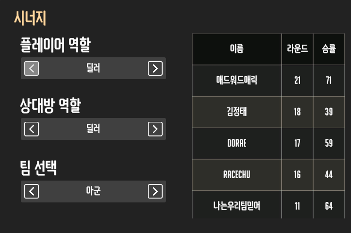

# 클랜 통계 기획

**2026-09-24 · D-STATS-05·06 · 정보 구조·UI/UX 기획 확정, 1차 구현 진행.** 기존 `요약 / 명예의 전당 / 경기 기록 / 앱 이용` 4탭 기획을 이 문서로 대체한다. 아래 목표와 실제 적용 범위는 §7에서 구분한다.

## 1. 정보 구조

경로는 `/games/[gameSlug]/clan/[clanId]/stats`를 유지하고 아래 세 영역으로 구성한다. 기본 진입은 명예의 전당이다.

| 영역 | 사용자가 확인할 내용 | 구성 원칙 |
|---|---|---|
| **명예의 전당** | 특정 기간에 누가 어떤 기록을 세웠는가 | 주요 지표의 순위·수상 기록. 일부 항목과 순위만 멤버에게 공개 |
| **내전 통계** | 우리 클랜의 내전이 어떻게 진행됐는가 | 경기·참여·맵·밴·편성 분석과 경기 아카이브 |
| **개인 기록** | 특정 멤버가 어떤 경기를 했는가 | 개인 전적·역할·맵·함께한 기록·상대 전적. 본인 기록으로 시작 |

기존 **앱 이용 통계는 `클랜 관리 → 개요 → 사이트 이용 통계`로 이동**한다. 사이트 방문과 실제 경기 참여를 분리하며, 내전 경기 수·순출전 인원은 내전 통계에 남긴다. 관리 영역의 상세는 [클랜 관리 명세](12-Clan-Manage.md)를 따른다.

공통 기간 선택은 월간·연간·전체를 지원한다. 세부 분석에는 기간 범위 선택을 제공하되 권한과 집계 기준을 동일하게 적용한다. 영역을 오갈 때 선택 기간을 유지하고 항상 적용 기간·집계 대상·표본 수를 확인할 수 있게 한다.

## 2. 명예의 전당

기간별 굵직한 기록을 순위로 보여준다. 전체 경기 분석이나 개인의 상세 분석은 해당 영역으로 연결한다.

| 순위·기록 | 지표 | 집계 조건 |
|---|---|---|
| 승률 | 승 / 출전 경기 수 | 최소 출전 기준 충족자만 등재. 승·무·패와 표본 수 병기 |
| 다승 | 화면에서 제외 | 기존 집계·공개 설정 값은 내부 호환용으로 보존 |
| 최다 출전 | 출전 경기 수 | 한 세션에서 여러 경기 출전 시 각각 집계 |
| 최다 출석 | 유효 경기 1회 이상 출전한 KST 내전 날짜 수 | 같은 날 여러 내전은 1일. 사이트 접속·예약 참석 응답과 구분 |
| 최장 연승 | 기간 내 연속 승리 수 | 무승부는 연승 종료, 무효·미정은 제외 |
| 승부예측 | 적중률·적중 횟수 | 유효하게 정산된 예측만. 최소 예측 수 기준 필요 |
| 역대 기록 | 마감된 월·연도의 등재자와 기록 | 당시 기간·집계 기준·정정 여부 확인 가능 |

### 공개와 설정

- 운영진은 전체 집계를 확인하고, 멤버는 클랜이 공개한 항목·순위 범위만 확인한다. 공개하지 않은 항목은 멤버 화면과 응답에서 제외한다.
- 항목별 공개 여부와 상위 3 / 5 / 10 / 20위 / 전체 범위를 설정한다. 기존 승률·참여 계열 공개 설정은 새 항목으로 이관하며 조용히 초기화하지 않는다.
- 기존 월별 `상시 / 다음 달 1일`, 연도별 `상시 / 다음 해 1월 1일` 공개 방식을 유지한다. 진행 중 기간은 **집계 중**, 종료 기간은 **기간 마감**으로 구분한다. 과거 결과 정정 시 재집계할 수 있으므로 영구 불변 기록으로 표현하지 않는다.
- 설정은 `set_hof_rules` 권한: 기본 leader, officer는 위임 시 가능. 열람 권한과 분리한다.
- 외부 클랜 프로필에 공개하는 `expose_hof`는 별도 leader 전용, 기본 비공개를 유지한다. 멤버에게 공개했다고 외부에도 공개하지 않는다(D-ECON-03).
- 승부예측 항목은 기존 Premium·사용 설정·정산 규칙을 따른다. 통계 재분류를 이유로 다른 지표에 새로운 유료 제한을 추가하지 않는다.

### 등재 기준

기존 승률 최소 출전 규칙을 유지한다. 기간 내 전체 유효 경기 수가 설정 기준점 이하면 `ceil(전체 경기 수 × 설정 비율)`, 초과면 설정된 절대 최소 출전 수를 사용한다. 현재 설정 기본값은 기준점 100경기·비율 30%·절대 최소 30경기다. 실제 설정값이 있으면 그것을 우선한다.

표본 부족자는 등재에서 제외하되 본인 기록에는 실제 경기 수와 **등재 기준 미달**을 표시한다. 예측 최소 표본, 새 순위의 동률 처리·등재 상세는 구현 전에 확정할 조정 항목이다. 임의의 숫자를 이미 확정된 정책으로 적용하지 않는다.

## 3. 내전 통계

순위보다 경기 전체의 양상과 기록 탐색에 집중한다. 아래는 목표 목록이며 저장된 데이터가 없는 지표는 수집·연동 이후 제공한다.

| 묶음 | 제공할 내용 | 구분·주의 |
|---|---|---|
| 내전 개요 | 세션 수, 완료 경기 수, 순출전 인원, 세션당 평균 경기 수·출전 인원 | 열렸지만 경기를 완료하지 않은 세션도 세션 수에는 포함. 완료 경기 수는 별도 |
| 진행 추이 | 기간별 경기·참여 추이, 요일·시간대 분포, 무승부 비율 | 내전 날짜 기준 추이와 실제 경기 시각 분석 구분 |
| 맵 | 맵·유형별 진행 횟수, 후보·득표·최종 선정 빈도 | 후보 노출 수, 득표 수, 실제 플레이 수 구분 |
| 영웅 밴 | 영웅별 최종 밴 빈도, 밴 역할군 분포, 밴 없음 비율 | 영웅별 게이지는 전체 완료 경기 대비 최종 밴 경기 수. 투표와 최종 밴 구분 |
| 관계 | 같은 팀·상대 팀으로 만난 빈도 | 관계별 상세는 개인 기록. 편성 방식 빈도는 개발·운영 데이터로만 보존 |
| 균형 (관리 전용) | 팀 평가·분석 점수 합계 차이 | 클랜 관리 개요에서 표시. 경기 당시 스냅샷만 사용하고 현재 점수로 과거를 덮어쓰지 않음 |
| 경매 | 낙찰가·역할별 가격 분포, 팀별 사용·잔여 예산, 전략 아이템 구매 내역 | 미경매와 0pt 낙찰 구분. 아이템 효과와 승패의 인과관계 단정 금지 |
| 경기 아카이브 | 날짜·세션·맵·멤버로 찾는 경기 목록과 상세 | 결과, 양 팀 출전자·역할, 맵, 밴, 편성 방식·이력 |

- 클랜 내부 두 팀끼리 경기한 결과를 합친 **클랜 전체 승률**은 핵심 KPI로 사용하지 않는다. 승리와 패배가 함께 쌓여 의미 있는 클랜 성과 비교가 되지 않는다.
- 평균·비율에는 대상 수와 분모를 표시한다. 진행 중 세션을 포함한 수치는 **진행 중 포함**으로 구분한다.
- 세션당 평균 경기 수는 `완료 경기 수 / 실제 열린 세션 수`, 평균 출전 인원은 `세션별 순출전 인원 합 / 실제 열린 세션 수`다. 선택 기간의 무경기·진행 중 세션도 분모에 포함하고, 세션이 0개면 `기록 없음`으로 표시한다.
- 아카이브는 `view_match_records`에 따라 상세를 연다. 본인 결과 요약만으로 전체 로스터·비공개 상세가 열리지 않는다.
- 정정 요청·직접 정정·알림·before/after 이력 보존은 **D-STATS-02 유지**: 열람 권한자는 요청, `correct_match_records` 보유자는 직접 수정. 필수 사유 최대 500자, 같은 경기 active 요청 1건, 7일 만료, 운영진 수동 적용 원칙을 유지한다. 결과 선택은 현재 경기 결과 체계(1팀 승·2팀 승·무승부·무효)와 맞춘다.
- 대진표·스크림은 정규 내전 표본에 섞지 않는다. D-EVENTS-05의 대진표 별도 집계 원칙은 유지하되 별도 상단 탭 추가는 이 3영역 기획에 포함하지 않는다. 후속 배치는 별도 설계한다.

## 4. 개인 기록

개인 기록은 기본적으로 운영진만 열람한다. 운영진 중 `set_hof_rules` 권한 보유자가 `통계 공개 설정 → 멤버의 본인 개인 기록 열람 허용`을 켜면 멤버 본인만 열람할 수 있다. `hof_config.member_personal_records`의 누락·거짓은 비공개이며 탭과 서버 응답의 개인 데이터를 함께 제외한다. 운영진이 다른 멤버를 선택할 때 기존 상세 통계 권한을 적용한다. 상단에 선택 멤버와 기간을 표시해 보고 있는 대상을 명확히 한다.

| 묶음 | 제공할 내용 |
|---|---|
| 전적 요약 | 출전, 승·무·패, 승률, 최근 경기 결과 |
| 흐름 | 현재 연승·연패, 최장 연승·연패, 기간별 추이 |
| 역할별 기록 | 돌격·공격·지원별 출전 비중, 승·무·패, 승률 |
| 맵별 기록 | 맵·유형별 출전, 승·무·패, 승률 |
| 함께한 기록·상대 전적 | 기준 선수 역할 × 상대 멤버 역할 × 아군/적군에 따른 상대별 전적 |
| 참여 | 출전 세션 수·내전 날짜·참여 추이. 접속 일수와 구분 |
| 점수 변화 | 평가 점수·분석 점수 변화와 경기 당시 점수. 이력이 있을 때만 제공 |
| 승부예측 | 유효 예측 수·적중률·정산 기록. 코인 내역은 해당 본인의 접근 범위 유지 |
| 엠블럼 컬렉션 | 마감된 월간·연간의 공개 부문 1~3위. 금·은·동, 월간 메달·연간 방패 디자인. 호버·포커스·탭으로 기간·부문·순위 설명 |
| 경기 목록 | 개인 기록에서는 제거. 내전 통계의 참가자 이름 검색으로 조회 |

실제 사용 영웅·KDA·피해량·치유량·영웅 숙련도는 현재 역할·밴 데이터로 추정하지 않는다. 해당 원본 데이터 수집이 선행되어야 한다.

### 4.1 시너지: 역할 조합 필터

사용자가 제공한 기존 시너지 화면을 기준으로 **나의 역할과 상대 멤버의 역할을 독립적으로 선택**한다. `상대 멤버`는 아군도 포함하는 비교 대상이며 `적군`과 혼용하지 않는다. 다른 멤버 기록에서는 `나의 역할` 대신 **선택 멤버 역할**로 표시한다.

이미지는 필터 구조의 참고다. 작은 화살표로만 선택하도록 제한하지 않고 선택 버튼 또는 드롭다운으로 모든 옵션을 쉽게 확인하게 한다.

| 조건 | 선택지 | 적용 기준 |
|---|---|---|
| 기준 멤버 | 기본 본인, 접근 가능한 다른 멤버 | 닉네임 대신 고유 사용자 ID로 집계 |
| 기간 | 월간·연간·전체·범위 | 개인 기록의 기간과 공유 |
| 나의 역할 / 선택 멤버 역할 | 전체 · 돌격 · 공격 · 지원 | 해당 경기의 기준 멤버 실제 배정 역할 |
| 상대 멤버 역할 | 전체 · 돌격 · 공격 · 지원 | 해당 경기의 상대 멤버 실제 배정 역할 |
| 팀 관계 | **아군 / 적군** | 해당 경기에서 같은 팀인지, 반대 팀인지 |

기본은 `본인 / 선택 기간 / 역할 전체 / 상대 역할 전체 / 아군`이다. 제목은 **시너지**로 통일하며 팀 관계를 바꿔도 나머지 조건은 유지한다. 세 역할끼리 9개 조합과 전체 선택을 지원한다. 공격 1·2, 지원 1·2 슬롯은 각각 같은 역할로 묶는다.

예시:

- `나: 공격 / 상대: 지원 / 아군` → **내가 공격으로 출전했을 때, 같은 팀에서 지원으로 출전한 멤버별 기록**.
- `나: 돌격 / 상대: 돌격 / 적군` → **내가 돌격으로 출전했을 때, 상대 팀 돌격 멤버와 맞붙은 기록**.
- 같은 상대가 경기마다 다른 역할을 했다면 그 경기의 역할 조건에 맞는 집계에만 포함한다. 현재 프로필 역할·선호 역할로 과거 경기를 분류하지 않는다.

### 4.2 상대별 표와 상세

| 열 | 의미 |
|---|---|
| 멤버 | 비교 대상 이름. 본인은 제외 |
| 경기 수 | 모든 필터를 동시에 만족하는 완료 경기 수 |
| 승 · 무 · 패 | **기준 멤버 관점**의 경기 결과 |
| 승률 | 기준 멤버의 승 / (승 + 무 + 패) × 100 |

기본 정렬은 경기 수 내림차순이다. 경기 수·승·무·패·승률의 열 제목을 누르면 오름차순/내림차순으로 전환한다. 현재 정렬 방향과 표본 수를 표시한다. 표본이 적은 높은 승률을 곧바로 ‘최고 시너지’로 단정하지 않는다. 최소 표본 필터와 **표본 적음** 기준값은 구현 전에 정한다.

행 선택 시 해당 조합의 실제 경기 목록으로 연결한다. 날짜·세션/라운드·양쪽 역할·아군/적군·결과를 확인하며 전체 경기 상세는 별도 열람 권한을 적용한다. 호버 팝업이 다른 행 선택을 가리는 구조는 사용하지 않는다.

### 4.3 집계 규칙과 검증 예시

1. 기간과 경기 유효성을 먼저 적용한 뒤 기준 멤버 역할·상대 역할·팀 관계의 **교집합**을 구한다.
2. 같은 경기에서 같은 두 멤버의 관계는 1회만 센다. 슬롯 중복·재추첨 이력·양쪽 방향으로 두 번 세지 않는다.
3. 적군 전적의 승률도 기준 멤버가 상대를 상대로 이긴 비율이다. 아군과 적군을 합산하지 않는다.
4. 무승부는 경기 수·분모에 포함한다. 무효·미정은 제외한다. 0경기는 `기록 없음`으로 표시하며 0%로 꾸미지 않는다.
5. 역할이 없는 과거 기록은 **역할이 미상인 선수 쪽 필터가 `전체`일 때만** 관계·결과 집계에 포함할 수 있다. 예를 들어 기준 선수는 공격, 상대 역할은 미상이면 `공격 × 전체`에 포함한다. 특정 역할 필터를 적용한 선수의 역할이 누락됐다면 그 경기는 제외하고 역할 미상 기록 수를 안내한다. 현재 역할로 보간하지 않는다.
6. 한 경기에서 여러 아군·적군을 각각 만나므로 상대별 경기 수의 합은 개인 출전 수와 다를 수 있다. 이 합으로 개인 출전 수를 역산하지 않는다.
7. 팀·역할·결과가 사후 정정되면 영향을 받은 관계 전적과 HoF·개인 기록을 같은 기준으로 재집계한다.

**예시:** A가 공격, B가 지원으로 같은 팀에서 치른 경기가 2승 1무 1패라면 `4경기 · 2승 1무 1패 · 50%`다. A가 지원으로 바뀐 경기는 `A 공격` 조건에서 제외한다. 같은 B가 적군 지원으로 출전한 경기는 `적군`에서만 집계하며 A가 이겼으면 A 기준 1승이다.

## 5. 공통 집계 기준

| 항목 | 기준 |
|---|---|
| 영구 집계 범위 | 정규 내전. 깜짝 내전은 종료 후 영구 통계·HoF에서 제외(로비 명세 유지) |
| 완료 경기·출전 | 승·무·패가 확정된 라운드. 무효·미정은 전적·출전 수에서 제외하며 아카이브에는 상태로 구분 가능 |
| 세션 수 | 실제 열린 세션 ID의 distinct. 예약만 된 방·편성 재시도·라운드를 별도 세션으로 세지 않음 |
| 개인 출석 일수 | 유효 경기 1회 이상 출전한 KST 내전 날짜의 distinct. 같은 날 여러 내전에서 5경기를 해도 **출석 1일, 출전 5경기**. 부모 내전이 없는 과거 경기도 날짜가 있으면 출석에 포함 |
| 순출전 인원 | 기간 내 유효 경기에 출전한 멤버 ID의 distinct. 월별 distinct 합으로 연간 인원을 만들지 않음 |
| 승률 | `승 / (승 + 무 + 패) × 100`. 반올림은 표시할 때만 적용 |
| 연승·연패 | 기준 선수의 경기 순서대로 계산. 무승부는 연속 종료, 무효·미정은 건너뜀 |
| 기간 내 최장 연속 | 선택 기간 안의 경기로 계산. ‘현재 연속’은 최신 전체 기록 기준으로 별도 표시 |
| 경기 날짜 | 세션을 연 KST 날짜인 **내전 날짜** 유지. 자정 이후 라운드도 동일. 실제 시작 시각 분석은 시각 원본 별도 사용 |
| 사이트 이용 날짜 | D-STATS-03의 클랜 시간대 자정 기준. 내전 날짜·코인 일일 집계일과 혼용하지 않음 |
| 승부예측 표본 | 기존 정산 정책상 적중/실패로 확정된 예측. 취소·환불·미정산을 실패로 계산하지 않음 |
| 출처 누락 | 세션·역할·시각·점수 이력이 없으면 `기록 없음 / 집계 불가`. 현재값으로 과거 사실을 만들지 않음 |

부모 세션 정보가 없는 과거 독립 경기는 경기 전적에 사용할 수 있으나 한 경기를 임의의 한 세션으로 만들어 참여 횟수를 부풀리지 않는다. 연결 가능한 범위와 누락 건수를 구분한다. 여러 원본을 병합할 때 동일 경기는 한 번만 집계한다.

## 6. 열람·관리 권한

클랜 멤버십 확인 후 기존 D-PERM-01·D-PRIV-01을 적용한다. 이 재분류만으로 모든 멤버의 세부 점수·관계 전적·코인 내역을 공개하지 않는다.

| 정보·행동 | 권한 원칙 |
|---|---|
| 명예의 전당 | 운영진 전체 집계, 멤버는 설정된 항목·기간·순위 범위. 외부 공개 별도 |
| 내전 개요·익명 집계 | 클랜 멤버 열람. 개별 선수 수치·상세는 해당 권한 적용 |
| 본인 개인 기록 | 기본 운영진 이상. 운영진의 공개 설정을 켠 경우에만 멤버 본인 허용. 상대·전체 경기 기록 권한은 별도 |
| 타인 개인 기록 | 기존 통계 권한 5종과 개인 비공개 오버라이드 적용 |
| 함께한 기록·상대 전적 | `view_synergy_winrate`와 양쪽 선수에 대한 접근 범위 확인. 본인 화면에서도 비공개 상대별 수치를 새로 노출하지 않음 |
| 경기 상세 | `view_match_records`: 기본 leader·officer, member는 클랜 허용 시 |
| 직접 정정 / HoF 설정 / CSV | 각각 `correct_match_records` / `set_hof_rules` / `export_csv`: 기본 leader, officer는 위임 시 |
| 클랜 관리의 이용 통계 | leader·officer 전용. 일반 멤버의 본인 방문 기록 적립은 유지 |

기존 통계 권한 5종은 `view_monthly_stats`, `view_yearly_stats`, `view_synergy_winrate`, `view_map_winrate`, `view_mscore`다. 전체·임의 기간으로 바꿔 월·연 제한을 우회하지 않도록 같은 항목의 가장 제한적인 적용 권한을 사용한다. 분석 점수의 타인 공개도 평가 점수와 동일한 접근 수준으로 다루며 상세 매핑은 구현 시 권한 명세와 함께 검증한다.

멤버 viewer는 대상 멤버의 비공개 오버라이드를 따른다. 운영진은 기존 D-PRIV-01에 따라 개인 오버라이드를 우회하더라도 클랜 권한 검사를 통과해야 한다. HoF 공개 순위와 개인 상세 열람은 서로 다른 정책이다.

제한은 화면 숨김만으로 처리하지 않는다. 서버 응답·직접 경로·CSV·차트 상세·집계의 상대별 행에도 동일하게 적용한다. CSV 권한이 원본 데이터의 열람 권한을 대신하지 않는다.

## 7. 기존 구현과 데이터 준비

2026-09-24 기준 3영역 화면과 정규 내전 집계의 1차 구현이 QA에 적용됐다. 목표 전체가 완료된 것은 아니며 현재 범위는 다음과 같다.

| 현재 적용 | 남은 작업 |
|---|---|
| `/stats`의 명예의 전당·내전 통계·개인 기록 3영역. 방문은 관리 개요로 이동 | 기간 범위 공유, 그래프의 주별 탐색·필터 복원, 모바일/접근성 추가 검증 |
| HoF 승·무·패 승률, 출석 일수·출전·연승·예측 적중, 현재/지난 월·연 순위와 공개 상한 | 예측 적중률 최소 표본 확정, 당시 설정/정정 이력을 함께 보존하는 역대 스냅샷 |
| 정규 내전의 세션·완료 경기·순출전 인원·월 추이·맵·밴·편성·점수 차이·경매 로그 | 요일×시간대, 예상 우세의 실제 결과, 경매 회차별 상세·검색 |
| 본인 전적·연속·역할·맵·점수·예측, 운영진의 역할별 아군/적군 관계 | 개인 비공개 오버라이드 영속화 후 일반 멤버의 허용된 관계/타인 기록, 상대별 표본 기준, 코인 상세 |
| 완료 경기·출전과 세션 개설·참여를 구분하고 무효·미정·깜짝 내전을 제외 | 레거시 독립 경기의 세션 출처 누락 수치와 과거 중복 근거 표시 |
| 관리 전용 방문 화면과 방문 원본 RLS, 종료 후 예측 원본의 본인/운영진 RLS | 방문 내보내기 권한과 추가 세부 이벤트 수집은 별도 설계 |

준비 수준은 **기존 원본으로 재집계 / 이력 보존 확인 필요 / 신규 수집 필요**로 구분한다. 실제 사용 영웅·퍼포먼스, 기능별 앱 이용 이벤트는 신규 수집 대상으로 남긴다. QA 표시용 샘플 점수·샘플 예측은 실제 분석 결과에 포함하지 않는다. 개인 비공개 오버라이드 저장소가 아직 없으므로 일반 멤버에게는 타인 상세·상대별 기록을 열지 않고 운영진 범위로 제한한다.

## 8. 통계 UI/UX

**D-STATS-06 · 2026-09-24 사용자 승인.** 각 통계를 쉽게 이해하고 운영상 중요한 내용을 먼저 확인하도록 **핵심 숫자 → 변화·비교 → 실제 경기 기록** 순서로 구성한다. 아래는 확정한 표현·탐색 방향이며 새 데이터 수집이나 열람 권한 확대를 뜻하지 않는다.

**2026-09-24 화면 피드백 반영:** 사용자에게 보이는 `세션`은 `내전`으로 표기한다. 대표 카드 4개는 데스크톱 1행·모바일 2열이며, 아이콘을 제목 옆에 배치하고 닉네임과 수치는 같은 행에 둔다. 출석·출전·승률·맵·영웅 밴·개인 역할/맵 전적에는 분모가 명확한 게이지를 적용한다. 게이지는 별도 막대가 아니라 해당 행·카드 배경 전체를 왼쪽부터 비율만큼 채우고, 이름·수치는 그 위에 표시한다. 최장 연승에는 임의 비율을 만들지 않는다. 편성 점수 차이는 관리 화면에서만 전달·표시한다. 예측은 기존 적중 횟수 순위를 유지하고, 행의 게이지로 적중률을 함께 설명한다.

**추가 UI 결정:** 각 통계 설명은 제목 옆 `i` 도움말로 이동한다. 마우스 호버·키보드 포커스·모바일 탭을 지원한다. `승/무/패`와 `10승 / 1무 / 2패` 형식을 통일하고 최장 연승·연패 제목의 ‘선택 기간’은 도움말에서 설명한다. 기간·역할·정렬·결과 필터는 [React Bits Option Wheel](https://reactbits.dev/components/option-wheel)을 기반으로 제어형 컴포넌트로 적용한다. 휠·드래그·방향키·Home/End·이전/다음 버튼을 지원하고 모션 감소 설정을 따른다. 라이선스는 [보관 문서](../../licenses/react-bits.md)에 둔다. 엠블럼은 현재 원본에 따른 지난 기간 순위로 계산하며 영구 지급 스냅샷은 후속이다.

### 8.1 화면별 우선순위

| 화면 | 첫 화면의 순서 | 추가 탐색 |
|---|---|---|
| 명예의 전당 | 승률·최다 출석·최다 출전·예측 적중 대표 기록 → 선택한 부문의 순위 목록 | 부문·기간 전환, 개인 기록·역대 등재 |
| 내전 통계 | 핵심 숫자 3개 → 월별 추이 → 맵·밴 → 경기 기록 | 맵·밴·경매의 주제별 요약에서 상세 열기 |
| 개인 기록 | 전적·최근 흐름 → 역할별 기록 → 함께한 기록·상대 전적 | 맵·참여·점수·예측·수상·전체 경기 |
| 관리의 사이트 이용 통계 | 방문 규모 → 변화 추이 → 월·연 비교 | 기간 비교, 날짜별 수치·표 보기 |

상단 탭은 기존에 확정한 3영역을 유지하며 기본 진입은 명예의 전당이다. 각 영역에 큰 차트를 모두 나열하지 않고 대표 그래프·짧은 목록에서 필요한 상세로 들어간다. 화면 우선순위는 구현 순서와 구분한다. 아직 원본이 준비되지 않은 분석은 가짜 수치 대신 준비 상태를 안내한다.

### 8.2 명예의 전당 표현

상단의 승률·최다 출석·최다 출전·예측 적중 대표 기록은 작게 배치한다. 아래 **하나의 공통 순위 영역**에서 부문을 바꾸며, 멤버에게는 공개된 부문·순위만 표시한다. 대표 기록도 동일한 공개 시점·등재 기준을 따른다. 비공개 부문의 자리나 등재자가 없는 자리를 샘플 수상자로 채우지 않는다.

| 항목 | 표현 | 인터랙션 |
|---|---|---|
| 승률 순위 | 닉네임·승률과 0~100% 게이지. 출전 경기 수와 승·무·패 병기 | 멤버 선택 → 같은 기간 개인 기록. 등재 기준 설명 제공 |
| 다승 순위 | 대표 카드·순위 선택·공개 설정 UI에서 제외 | 저장된 설정은 초기화하지 않음 |
| 최다 출전 | 출전 경기 / 기간 전체 유효 경기 게이지. 기간 전체 내전 횟수 병기 | 선택 → 개인 기록 |
| 최다 출석 | 출석 일수 / 전체 개최 일수 게이지. 기간 전체 내전 횟수 병기 | 선택 → 개인 기록 |
| 최장 연승 | 연승 수·달성 기간과 작은 승리 기록 띠 | 선택 → 연승을 구성한 경기 순서 펼치기 |
| 승부예측 | 적중률과 적중/유효 예측 수 병기 | 적중률·적중 횟수 전환. 허용된 정산 기록으로 연결 |
| 역대 등재 | 전체 / 월별 / 연도별 전환과 기록이 존재하는 모든 과거 월·연도 선택기 | 기간 선택 → 당시 명예의 전당 |

위 숫자는 표현 예시다. 왕관·메달은 상위 기록에 제한적으로 사용하고, 부문 전환·순위 변경은 짧은 전환으로 표현한다. 순위가 실시간 갱신돼 읽던 행이나 포커스가 갑자기 바뀌지 않도록 한다.

### 8.3 내전 통계 표현

운영자가 **얼마나 열렸는지, 누가 출전했는지, 편성이 어떤 상태였는지**를 먼저 판단하게 한다. 대표 숫자는 `개최 내전 / 완료 경기 / 출전한 멤버`의 3개다. 숫자 선택으로 아래 대표 그래프의 지표를 전환한다.

| 항목 | 표현 | 인터랙션 |
|---|---|---|
| 세션 수·완료 경기·순출전 인원 | 단위가 분명한 핵심 숫자 3개 | 선택한 지표로 대표 그래프 전환 |
| 세션당 평균 경기·출전 인원 | 관련 핵심 숫자 아래의 작은 보조 수치 | 평균 계산 대상·분모 확인 |
| 참여·경기 추이 | 월별 꺾은선 그래프. 출전 인원·개최·경기 전환 | 월 버튼 선택 → 해당 기간 경기 기록 필터 |
| 편성 점수 차이 | **클랜 관리 → 개요**로 이동. 평균과 점수 차이 구간별 경기 비율 게이지 | 운영진·점수 열람 권한 적용. 평가·분석 점수 전환 |
| 예상 우세 팀의 실제 결과 | 예상 우세 팀의 승리 수/경기 수와 승·무·패 비율 띠 | 편성 방식별 조회. 예측을 확인할 수 있는 경기로 연결 |
| 경기 아카이브 | 중복된 최근 경기 카드는 제거. 날짜·내전으로 묶인 기록 목록 | 행 펼치기 → 양 팀 명단·역할·밴. 날짜·맵·멤버 검색 |
| 편성 방식 | 사용자 통계 카드는 제거 | 개발·운영 분석용 원본·집계는 보존 |
| 같은 팀·상대 팀 빈도 | 멤버 선택 시 자주 만난 멤버 목록 | 같은 팀·상대 팀 전환 → 개인의 관계 기록 |
| 요일·시간대 | 요일 × 시간대 색상표. 많이 열린 구간을 진하게 표시 | 칸 선택 → 해당 시간대 세션 |
| 맵·유형별 빈도 | 맵 썸네일과 사용 경기 / 전체 경기 게이지 | 유형 필터, 진행 횟수순·이름순 정렬, 맵별 기록 열기 |
| 맵 투표·선정 | 후보 등장·득표·최종 선정 수치를 맵별로 나란히 표시 | 지표 전환, 해당 맵의 투표 기록 확인 |
| 영웅 밴 | 초상화·밴 횟수·밴 비율 순위, 역할별 필터 | 초상화 선택 → 해당 영웅이 밴된 경기 |
| 밴 없음·밴 역할 분포 | 짧은 비율 띠와 경기·팀 수 | 구간 선택 → 해당 밴 조건의 기록 |
| 경매 낙찰가 | 역할별 대표 낙찰가·금액 구간별 낙찰 건수 막대 | 구간 선택 → 실제 낙찰 기록. 금액·해당 회차 예산 대비 비율 전환 |
| 예산·전략 아이템 | 양 팀 지출·잔액 비교 막대, 아이템 구매 목록 | 경매 선택 → 낙찰 순서·구매 내역 펼치기 |

- 편성 점수 차이에는 **편성 당시 점수 기준**을 명시한다. 실제 경기의 접전 정도나 공정성 점수로 이름을 바꾸지 않는다. 비교 분포는 양 팀 합계의 차이 크기를 사용한다.
- 맵 후보 수·표 수·선정 경기 수는 단위가 다르다. 값이나 비율의 분모를 각각 적고 한 누적 막대의 조각으로 합치지 않는다. 영웅 밴 투표와 최종 밴도 구분한다.
- 요일·시간대는 내전 날짜와 실제 시작 시각의 집계 목적을 표시한다. 시작 시각이 없는 기록을 임의 시간대에 넣지 않는다.
- 경매 금액 막대의 건수는 **낙찰 기록 수**다. 한 경기에 여러 선수가 낙찰될 수 있으므로 경기 수와 혼용하지 않는다. 이력이 없는 금액·잔액은 추정하지 않는다.

### 8.4 개인 기록 표현

| 항목 | 표현 | 인터랙션 |
|---|---|---|
| 출전·승무패·승률 | 큰 승률, 승·무·패 숫자, 한 줄 결과 비율 띠 | 승·무·패 선택 → 경기 목록 필터 |
| 최근 경기·현재 연속 | `승 승 무 패 승`처럼 읽히는 최근 경기 띠와 현재 연승·연패 | 결과 선택 → 해당 경기 상세 |
| 최장 연승·연패 | 기록 수치와 달성 기간 | 선택 → 해당 연속 기록의 경기 펼치기 |
| 역할별 전적 | 돌격·공격·지원 3행에 아이콘·경기 수·승률 정렬 | 역할 선택 → 해당 역할의 전적·경기 목록 |
| 함께한 기록 | 두 역할 필터와 상대별 정렬 가능한 표. 경기 수·승률 함께 강조 | 멤버 선택 → 함께한 경기 목록 |
| 상대 전적 | 같은 표를 유지하고 상대 팀 조건으로 전환 | 멤버 선택 → 그 멤버가 적팀이었던 경기 |
| 맵별 전적 | 맵 썸네일·경기 수·승률 목록 | 유형 필터, 출전순·승률순 정렬, 근거 경기 |
| 참여 날짜 | 개인 기록에서 제외 (2026-09-24 확정) | 날짜별 탐색은 내전 통계의 경기 기록 이용 |
| 평가·분석 점수 변화 | 시간에 따른 선 그래프. 선택한 점수 하나를 우선 표시 | 점수 전환, 지점 선택 → 당시 점수·관련 기록. 긴 이력은 구간 선택 |
| 승부예측 기록 | 적중률 요약과 최근 적중·실패·환불 기록 | 결과별 필터와 허용된 정산 상세 |
| 수상 이력 | 기간·부문을 적은 작은 메달 목록 | 선택 → 해당 기간 명예의 전당 |
| 전체 경기 목록 | 개인 기록에서 제외 | 내전 통계의 이름 검색으로 탐색 |

현재 연속은 §5의 최신 전체 기록 기준임을 표시한다. 선택 기간의 최장 연속이나 특정 역할로 좁힌 전적과 혼동하지 않는다. 점수 이력이 없는 구간을 연결해 변화가 확인된 것처럼 표현하지 않는다.

**역할별 관계 기록의 기본 화면**

> 내 역할 [지원]　관계 [같은 팀]　상대 역할 [돌격]
>
> 내가 지원으로 출전했을 때, 같은 팀 돌격 멤버와의 기록

다른 멤버 기록에서는 `내 역할`을 `선택 멤버 역할`로 바꾼다. 아래는 수치 표현 예시이며 실제 데이터가 아니다.

| 멤버 | 함께한 경기 | 승·무·패 | 승률 |
|---|---:|---|---:|
| 멤버 A | 20경기 | 12승 2무 6패 | 60% |
| 멤버 B | 8경기 | 5승 0무 3패 | 62.5% |

- 기본은 경기 수순이며 표의 경기 수·승·무·패·승률 제목으로 양방향 정렬한다. 최소 표본 조건과 경기 수를 가까이 둔다.
- 관계를 바꾸면 설명도 **상대 팀으로 만났을 때 내 승률**로 바꾼다. 개인 간 1:1 결투 승률·상성으로 표현하지 않는다.
- 추가 보기로 **3×3 역할 조합표**를 제공한다. 세로는 기준 멤버 역할, 가로는 상대 역할이며 각 칸에 승률과 경기 수를 함께 적는다. 칸 선택으로 양쪽 역할을 동시에 적용하고 같은 결과 목록으로 연결한다.
- 특정 상대를 선택하면 그 멤버와의 9개 조합을 보여준다. 상대 전체일 때 셀의 경기 수는 해당 조합을 만족하는 **고유 경기 수**이며 상대별 행 합과 구분한다. 같은 경기에서 같은 역할의 아군을 둘 만났어도 그 셀의 경기 수는 한 번만 센다. 전체 출전 수는 여러 셀의 합으로 만들지 않는다.
- 역할 미상은 특정 역할의 셀에 포함하지 않고 별도 건수로 안내한다. 0경기는 `기록 없음`, 소표본은 실제 수치와 `표본 적음`으로 표시한다. 소표본 기준값은 기존 미결 항목으로 유지한다.

### 8.5 사이트 이용 통계 표현

`클랜 관리 → 개요 → 사이트 이용 통계`에서 방문자 수·활동일 보조 수치 → 대표 추이 → 월·연 비교 순서로 배치한다. [관리 명세의 항목별 표현](12-Clan-Manage.md#site-usage-ui)을 단일 기준으로 사용한다. 사이트 방문 달력은 경기 출전과 구분한다. 개인 기록의 참여 달력은 제공하지 않는다.

### 8.6 공통 탐색·편의성

1. **대표 행동 하나:** 차트의 막대·칸을 선택하면 그 조건의 기록, 멤버 이름을 선택하면 개인 기록을 연다. 서로 다른 동작은 별도 버튼과 이름으로 구분한다. 작은 표시만 겨냥하지 않아도 행·칸 단위로 선택할 수 있게 한다.
2. **조건 표시와 해제:** 기간·역할·팀 관계·맵 등 적용 조건을 칩으로 계속 보여주며 개별 해제와 초기화를 제공한다. 전체 기간과 해당 차트에서만 적용한 조건을 구분하고, 필터 추가로 값이 변한 이유가 보이게 한다.
3. **상세에서 복귀:** 통계 → 근거 경기 → 통계 이동 시 기간·필터·정렬·스크롤을 유지한다. 드로워 안에서 또 드로워를 겹치지 않고 하나의 상세 영역을 사용한다. 원래의 상세 열람 권한을 충족하지 않으면 허용된 공개 요약만 보여준다.
4. **호버·클릭·터치:** 호버는 짧은 수치 확인에 사용한다. 자세한 내용은 클릭으로 고정된 패널에서 확인하고 다른 행 선택을 가리지 않는다. 모바일 탭과 키보드로도 같은 정보·행동에 접근한다.
5. **쉬운 문장과 단위:** `이번 달 18명이 출전했습니다`처럼 수치를 설명한다. 출석은 일수, 내전은 개최 횟수, 출전은 경기, 방문은 사이트 이용으로 구분한다. 비율에는 표본·분모·기간을 병기한다.
6. **기간 비교:** 이전의 동일 길이 기간과 비교하고 비교 날짜를 표시한다. 진행 중 기간은 `집계 중` 표시와 점선 등으로 구분한다. 승률 변화는 %p, 인원·횟수는 해당 단위로 적으며 비교 대상이 없으면 억지 증감을 만들지 않는다.
7. **색과 접근성:** 팀 비교는 기존 파랑·빨강, 일반 추이는 민트 계열을 사용한다. 승무패·역할은 문자·아이콘을 병기하고 색만으로 구분하지 않는다. 차트의 주요 값은 텍스트로 제공하고 상세에서는 표로도 확인할 수 있게 한다.
8. **반응형:** 좁은 화면은 핵심 수치·차트를 세로로 재배치한다. 표의 닉네임과 핵심 전적을 우선 노출하며 나머지는 펼쳐 본다. 역할 필터는 줄바꿈해도 각각의 이름·선택 상태가 보이게 한다. 기간 드래그에는 날짜 선택 대안을 제공한다.
9. **데이터 상태:** 로딩·오류·비공개·원본 미수집·기록 없음·표본 부족을 구분한다. 오류나 비공개를 0명·0%로 표현하지 않는다. 최소 표본 기준·기간 미상·역할 미상은 근처 설명으로 확인한다.
10. **의미 있는 움직임:** 필터 변경 시 차트 전환, 순위 변경 시 행 이동, 선택 구간 강조에 짧은 움직임을 사용한다. 반복 재생·불필요한 카운트업은 사용하지 않고 동작 줄이기 설정과 키보드 포커스를 존중한다.

### 8.7 레퍼런스와 채택 범위

2026-09-24 검토한 자료다. 아래 서비스의 패턴을 참고하되 **ClanSync에 적용할 UI/UX는 본 절의 결정**을 따른다. 라이브러리를 모두 도입하거나 각 서비스의 기능을 그대로 구현한다는 뜻은 아니다.

| 레퍼런스 | 확인한 패턴 | 채택할 부분 |
|---|---|---|
| [Plausible](https://plausible.io/docs/guided-tour) | 지표 선택으로 대표 그래프 전환, 기간 비교·필터·상세 확장 | 운영 통계의 화면 밀도, 핵심 숫자와 대표 그래프 연결 |
| [Metabase](https://www.metabase.com/docs/latest/dashboards/interactive) | 차트 클릭으로 상세 탐색·조건 변경·다른 화면 연결 | 숫자에서 근거 경기로 이동하는 공통 흐름 |
| [OP.GG](https://help.op.gg/hc/en-us/articles/30994064577433-What-qualifies-as-a-Recently-played-with) | 함께 플레이한 동료의 승률·기록 | 함께한 기록의 상대 목록과 근거 전적 |
| [FACEIT Track](https://support.faceit.com/hc/en-us/articles/17012729714972-FACEIT-Track-Overview) | 통계·경기 기록·맵 성과와 기간·맵 필터 | 개인 통계와 경기 목록의 연결. 복귀 상태 유지는 ClanSync 요구 |
| [GitHub 활동 기록](https://docs.github.com/en/account-and-profile/how-tos/contribution-settings/viewing-contributions-on-your-profile) | 활동 날짜를 선택해 관련 기록 탐색 | 사이트 이용 날짜별 탐색 참고 (개인 참여 달력은 제외) |
| [Nivo Calendar](https://nivo.rocks/calendar/) · [Heatmap](https://nivo.rocks/heatmap/) | 달력·행열 조합 시각화 예시 | 사이트 방문 달력과 추가 보기인 역할 조합표 |
| [Recharts 구간 선택](https://recharts.github.io/en-US/examples/BrushBarChart/) | 그래프 아래에서 표시 구간 선택 | 긴 점수 이력의 구간 탐색. 날짜 입력 대안 병행 |

사용자가 제공한 [통계 UX/UI 레퍼런스 글](https://medium.com/@bunny753358/%ED%86%B5%EA%B3%84-ux-ui-%EB%A0%88%ED%8D%BC%EB%9F%B0%EC%8A%A4-%EC%82%AC%EC%9D%B4%ED%8A%B8-5ce7228c2b26)은 탐색 출발점으로 보존한다. 차트 구현 도구 선정은 후속 구현에서 기존 프로젝트 구성과 함께 판단한다.

## 9. 구현 순서와 수용 기준

1. **기반 정리:** 정규 내전·세션/라운드·승무패·날짜·중복·권한 기준 통일. 사이트 이용 통계 관리 이전.
2. **첫 화면 구성:** 3영역, HoF 주요 순위·노출 설정, 내전 개요·아카이브, 개인 전적·역할·맵.
3. **역할별 관계 분석:** 함께한 기록·상대 전적 필터, 표 정렬, 경기 근거 연결, 표본·역할 미상 표시.
4. **추가 분석:** 데이터 보존을 확인한 맵 투표·밴·균형·경매·점수 변화·예측 기록.

아래는 향후 구현 검증 항목이며 이번 문서화로 완료 처리하지 않는다.

- [ ] 통계는 3영역이며 앱 이용은 관리에서만 접근한다. 기간 선택과 권한 없는 직접 접근을 확인한다.
- [ ] 멤버 HoF는 허용된 항목·기간·상위 범위만, 운영진은 전체 집계를 본다. 외부 공개는 별도다.
- [ ] 같은 날짜의 여러 내전 5경기는 출석 1일·출전 5경기다. 깜짝·무효·미정·중복 원본을 구분한다.
- [ ] 무승부 포함 승률, 기간 경계의 내전 날짜, 무승부의 연속 종료와 정정 후 재집계를 확인한다.
- [ ] 같은 두 사람이 역할·팀을 바꾼 기록에서 9개 역할 조합 및 전체·아군·적군 결과가 분리된다.
- [ ] 역할 미상·0경기·소표본·닉네임 변경·중복 슬롯을 처리하고 상대별 합을 개인 출전 수로 사용하지 않는다.
- [ ] 상대별 표와 연결 경기 목록의 분모·결과가 일치한다. 타인 비공개·상세 기록·CSV 권한이 응답 단계에서도 지켜진다.
- [ ] 방문 활동일·방문 순인원·내전 순출전 인원이 서로 다른 지표로 표시된다.
- [ ] 내전 통계 첫 화면에서 핵심 숫자·월별 추이·맵·밴·경기 기록를 우선 확인한다. 공개 범위와 데이터 준비 상태를 따른다.
- [ ] HoF는 대표 기록과 공통 순위 영역으로 구성하며 부문 전환·미등재·비공개 상태를 처리한다.
- [ ] 지표 선택·차트 구간 선택이 연결된 그래프 또는 근거 기록에 반영되고 현재 조건을 확인·해제할 수 있다.
- [ ] 역할 조합표의 행·열·기준 멤버가 명확하며 셀의 고유 경기 수와 상대별 행 집계가 정의에 맞는다.
- [ ] 상세에서 복귀할 때 기간·필터·정렬·스크롤을 유지하며 호버 팝업이나 겹친 드로워가 탐색을 막지 않는다.
- [ ] 터치·키보드·좁은 화면·동작 줄이기에서 정보와 탐색 기능을 사용할 수 있다. 색상 외 텍스트·아이콘으로 결과를 구분한다.
- [ ] 기간 비교의 길이·집계 중 표시·단위가 정확하고 오류·비공개·미수집·무기록·소표본 상태를 구별한다.

## 관련 기준

- [D-STATS-05 정보 구조](../decisions.md#d-stats-05) · [D-STATS-06 UI/UX](../decisions.md#d-stats-06) · [통계 슬라이스](../slices/slice-05-clan-stats.md) · [권한표](../gating-matrix.md)
- [내전 용어](../glossary.md#내전-운영-용어) · [내전 로비](../../02-design/session-lobby.md) · [편성·경기 결과](../../02-design/formation-modes.md)
- [클랜 관리](12-Clan-Manage.md) · [클랜 셸](07-MainClan.md) · [스키마](../schema.md)
- [기존 통계 로더](../../../src/lib/clan/stats/load-clan-stats.ts) · [경기 정규화](../../../src/lib/clan/stats/normalize-clan-match-records.ts) · [세션 전적](../../../src/lib/balance/history.ts)
