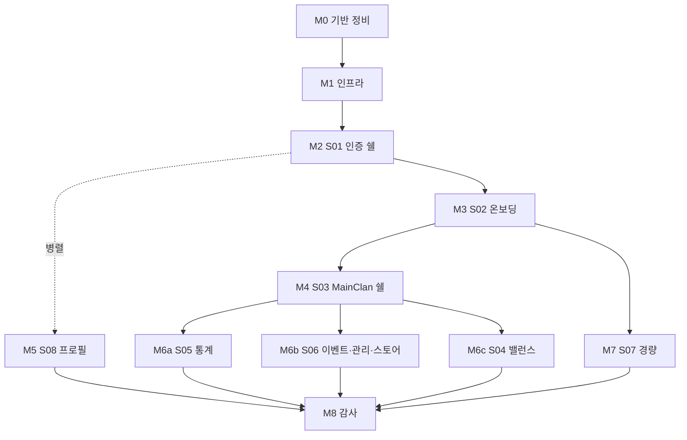

# Phase 2 — Next.js `src/` · Supabase · RLS

> **허브**: [TODO.md](./TODO.md) · **Phase 1(종료)**: [TODO_Phase1.md](./TODO_Phase1.md) · **세션 로그**: [TODO_LOG.md](./TODO_LOG.md)  
> **단일 출처**: [pages.md](./01-plan/pages.md) (라우트) · [schema.md](./01-plan/schema.md) (DB) · [FEATURE_INDEX.md](./01-plan/FEATURE_INDEX.md) (슬라이스)  
> **체감 로드맵(사람용)**: [PHASE2_EXPERIENCE.md](./PHASE2_EXPERIENCE.md) — 마일스톤 별명·30초 데모 시나리오·라이브 상태 표. **에이전트는 시연/리뷰/릴리즈 시점에만 열면 된다**(실구현 시 필수 아님).

| 항목 | 값 |
|------|-----|
| **단계** | Phase 2 — 앱 구현 |
| **마지막 갱신** | 2026-04-22 — **M6b** 스토어 `coin_transactions` 최근 내역 UI · **M6c** `/balance` 쉘(세션 비활성 CTA) |

## 전제 (Q&A 확정)

- **Q1 (로케일)**: `src/app/[locale]/`는 제거. `pages.md` 라우팅 맵을 1:1로 따른다. 다국어 재도입은 Phase 2+에서 `next-intl` 등으로 별건 처리.
- **Q2 (범위)**: Phase 2 종료선 = **S00~S06, S08 전체 + S07 경량 탭 4개**(홈·클랜 홍보·LFG·클랜 순위). 스크림 채팅(**D-SCRIM-01/02**)·게시판 상세(`/games/[g]/board/[postId]`)·승부예측 정산·서비스워커 푸시·다국어는 **Phase 2+** 이관.

## 마일스톤 로드맵

| 마일스톤 | 슬라이스 | 핵심 산출물 | 선행 | 상태 |
|----------|----------|-------------|------|------|
| **M0** 기반 정비 | — | `[locale]` 제거 · 랜딩 스텁 · 본 로드맵 문서화 | — | 완료 |
| **M1** 인프라 | — | Supabase 헬퍼 · `supabase/migrations/0001_init` · `middleware.ts` 골격 · ENV · `db:*` scripts | M0 | 완료 (Vercel preview 제외) |
| **M2** 인증 쉘 | **S01** | `/` · `/sign-in` · `/sign-up` · `/games` + D-AUTH-01 매트릭스 + D-AUTH-03/06/07 | M1 | 완료 |
| **M3** 온보딩 | **S02** | `/games/[g]/auth` (OAuth D-AUTH-02/05) · `/games/[g]/clan` (D-CLAN-01/02/04) + RLS 1차 | M2 | 완료 |
| **M4** MainClan 쉘 | **S03** | `/games/[g]/clan/[id]` 레이아웃·사이드바(D-SHELL-01/02/03)·`hasPermission()`(D-PERM-01)·플랜 토글 | M3 | 완료 |
| **M5** 프로필 | **S08** | `/profile` 네임플레이트·뱃지 케이스 (D-PROFILE-01~04) | M2 (병렬 가능) | 진행 중 |
| **M6a** 통계 | **S05** | MainClan `/stats` 탭 · HoF (D-STATS-03/04) | M4 | 완료 |
| **M6b** 이벤트·관리·스토어 | **S06** | `/events`(D-EVENTS-03) · `/manage`(D-CLAN-02 소비자·D-MANAGE-01~04) · `/store`(D-STORE-01/02·D-ECON-03) | M4 | 진행 중 |
| **M6c** 밸런스 | **S04** | `/balance` 세션·밴픽·M/A 점수·슬롯 (정산 서버정책은 Phase 2+ placeholder) | M4 | 진행 중 |
| **M7** 커뮤니티 경량 | **S07** | `/games/[g]` 홈·홍보(D-RANK-01)·LFG(D-LFG-01)·순위. 스크림 탭은 "Phase 2+ 예정" 안내만 | M3 | 진행 중 |
| **M8** 종료 감사 | — | `AUDIT-Phase2-YYYY-MM-DD.md` · Phase 2+ 이관 목록 · 허브 갱신 | M5·M6a~c·M7 | 대기 |

## 마일스톤 공통 완료 기준 (Gate)

매 마일스톤마다 아래 **기술 게이트 5 + UI/UX 게이트 3**을 전부 만족해야 다음으로 넘어간다.

### 기술 게이트 (5)

1. 해당 슬라이스의 **수용 기준 체크박스 전부 ✓**([FEATURE_INDEX.md](./01-plan/FEATURE_INDEX.md) 링크 참조).
2. [pages.md §페이지별 가드 체인 표](./01-plan/pages.md)의 대응 경로가 `middleware.ts`·Server Component 가드에서 **전부 통과**.
3. RLS 정책이 **leader / officer / member / guest** 4역할에서 최소 1 케이스씩 테스트 통과 (`supabase db test` 혹은 Playwright).
4. 본 문서의 **체크리스트·라우트 대응표 갱신**.
5. Nano-commit([.cursor/rules/git-nano-commit.mdc](../.cursor/rules/git-nano-commit.mdc)) 준수 + 세션 로그([TODO_LOG.md](./TODO_LOG.md)) 블록 추가.

### UI/UX 게이트 (3)

마일스톤에 UI 변경이 전혀 없는 경우(예: M1 인프라만)만 면제. 그 외 전부 필수.

6. **키보드 온리** — 마우스 없이 해당 마일스톤의 핵심 플로우 완주 가능(탭·엔터·스페이스).
7. **반응형 3폭** — 375 / 768 / 1280 px에서 레이아웃 깨짐·가로 스크롤 없음.
8. **로딩·에러·빈 상태** — 각 신규 화면에 세 상태 디자인이 전부 존재(빈 리스트 안내·실패 메시지·스켈레톤 또는 스피너).

> 집중 폴리시 구간(M5 프로필 · M8 종료 감사) 메모 및 각 마일스톤 30초 데모 시나리오는 [PHASE2_EXPERIENCE.md](./PHASE2_EXPERIENCE.md).

## 체크리스트 (마일스톤별 상세)

### M0 — 기반 정비

- [x] `src/app/[locale]/` 제거 + 랜딩 스텁 (`src/app/page.tsx`)
- [x] `docs/TODO_Phase2.md`에 M0~M8 마스터 플랜 반영
- [x] `docs/TODO.md` 권장 프롬프트·마지막 갱신, `docs/TODO_LOG.md` 세션 로그 (M2 착지 시 갱신)

### M1 — 인프라 베이스라인

- [x] `@supabase/ssr` + `@supabase/supabase-js` 도입
- [x] `src/lib/supabase/{server,client,middleware}.ts` 헬퍼
- [x] `supabase/migrations/0001_init.sql` — `users`·`user_game_profiles`·`games`·`clans`·`clan_members` + 기본 RLS
- [x] `middleware.ts` 골격 (세션 refresh + **D-SHELL-02** 쿼리 정화: `?role=`·`?plan=`·`?game=` 프로덕션 드롭)
- [x] `.env.local` / `.env.example` 템플릿 (`next.config.ts` 서버 전용 ENV 분리는 M2 이후 서버 액션 도입 시 `env` 블록 or `serverRuntimeConfig` 로 확장)
- [x] `package.json` scripts: `db:reset` · `db:push` · `types:gen`
- [x] **Vercel preview URL 자동 발급** — `vercel link` + GitHub 연동 + Preview/Production 환경 변수 분리.

### M2 — S01 라우팅·쉘 (수직 슬라이스 첫 완주)

- [x] **픽스처·디버그** — [debug-and-fixtures.md](./01-plan/debug-and-fixtures.md) · **D-DEV-01**: `scripts/seed-fixtures.mjs` + `npm run db:seed` — 서비스 롤로 `fixture-solo@clansync-qa.local` 1계정(기존 시 스킵). 게임 카탈로그는 `0002` 시드.
- [x] `/` 랜딩 — **D-LANDING-04** 로그인 시 미들웨어에서 `/games` 리다이렉트(`?from=logo` 예외)
- [x] `/sign-in` — 이메일/비번 + **D-AUTH-06** 잠금(5회 연속/15분, [decisions.md §D-AUTH-06](./01-plan/decisions.md)) + **D-AUTH-07** 자동 로그인 토글(세션 쿠키 maxAge 24h/30d + `users.auto_login` 반영)
- [x] `/sign-up` — **D-AUTH-03** strong 비밀번호(8~72자)·출생연도(만 10세+)·약관
- [x] `/games` — Supabase 조회 기반 카드 + `routeFromGameCard` TypeScript · D-AUTH-01 라우팅(스텁: `/games/[g]/auth`·`/clan`·`/clan/[id]`)
- [x] 게이트: 익명 → `/sign-in?next=` · 로그인 후 `/games` · 카드 클릭 스텁까지 완주

### M3 — S02 게임·클랜 온보딩

- [x] `/games/[gameSlug]/auth` — **D-AUTH-02** 화면·CTA·비활성 게임 처리 · **D-AUTH-05** 안내 카피 · `?reauth=1` 분기 · 실 OAuth 전 **`DEV_GAME_LINK_SIMULATOR` / `NODE_ENV=development`** 시뮬레이터
- [x] `/games/[gameSlug]/clan` — 가입 탭(**D-CLAN-01** 검색·페이지 5 · **D-CLAN-02** 신청·취소·타 클랜 재신청 모달) + 생성 탭(**D-CLAN-04** payload + 서비스 롤 리더 멤버십)
- [x] RLS 1차: `0003` `clan_join_requests` 본인·운영진 SELECT, 본인 INSERT, 본인 pending→canceled UPDATE + `clans.game_id` 정합 `WITH CHECK`
- [x] 게이트: D-AUTH-01 미들웨어(`loadGameOnboarding`) — `/games/[g]`·`/auth`·`/clan`·`/clan/[id]` 분기

### M4 — S03 MainClan 쉘

- [x] `/games/[g]/clan/[clanId]` 레이아웃 + 사이드바 (**D-SHELL-01** 레일 hover·모바일 Sheet / **D-SHELL-03** manage 점 = pending 가입 신청)
- [x] 서버 헬퍼 `hasClanPermission` (**D-PERM-01** default + jsonb + 잠긴 키)
- [x] 플랜 게이트 — `clans.subscription_tier` + 클랜장 전용 dev 토글(`DEV_CLAN_PLAN_TOGGLE` / development)
- [x] 탭 스텁 5개 라우트 (`/balance`·`/stats`·`/events`·`/manage`·`/store`) · `/manage` 멤버 `forbidden()`
- [x] **D-SHELL-02** — 기존 미들웨어 정화 유지

### M5 — S08 프로필·꾸미기 (M2 이후 병렬 가능)

- [x] `/profile` — 네임플레이트·뱃지 스트립 (**D-PROFILE-01~03**, 5슬롯 dense-from-front) · 가입 신청 목록 (**D-PROFILE-02**)
- [x] 스키마: `nameplate_options` · `user_nameplate_inventory` · `user_nameplate_selections` · `badges` · `user_badge_unlocks` · `user_badge_picks` (`0010_profile_decorations_m5.sql`)
- [ ] `clansync:badge:picks:changed` 실시간 탭 동기화 — 클라이언트 `CustomEvent`만 (BalanceMaker·서버 패턴 확장은 후속)

### M6 — MainClan 탭 묶음 (M4 이후, 권장 순서 a→b→c)

- [x] **M6a S05 클랜 통계** — 요약 KPI · HoF(설정 모달·등재 규칙·전체/월/연) · **D-STATS-03** 활동일 표·내전 막대 · **D-STATS-04** CSV 안내만 · 경기 기록 일자 목록(캘린더·정정은 M6b 후속)
- [ ] **M6b S06 이벤트·관리·스토어** — **부분**: `0013`~`0015` · 관리·구독·스토어·Discord·D-STORE-02·배너·**`profile_entrance_fx` → `user_nameplate_inventory`(게임=클랜 소속)** · 스토어 **개인·클랜 풀(운영진+)** `coin_transactions` 최근 내역 · **잔여**: `purchases` 무효화·과금 카피·시각 효과 고도화
- [ ] **M6c S04 밸런스메이커** — **부분**: 세션 열기 비활성 쉘·스토어 코인 안내 · **잔여**: 세션·밴픽·M/A 점수·슬롯. 승부예측 정산은 Phase 2+ placeholder UI만

### M7 — S07 MainGame 커뮤니티 (경량판)

- [x] `/games/[g]` — 홍보 `board_posts`(**D-RANK-01** newest/space) · LFG `lfg_posts`/`lfg_applications`(**D-LFG-01** MVP) · 클랜 순위 미리보기(`clan_active_member_counts` RPC)
- [x] 스크림 탭 — "Phase 2+ 예정" 안내 유지
- [ ] `/games/[g]/board/[postId]` — **라우트 미작성** (Phase 2+)
- [ ] LFG 만료 cron·알림(D-EVENTS-03 in-app) — 후속

### M8 — Phase 2 종료 감사

- [ ] `docs/AUDIT-Phase2-YYYY-MM-DD.md` 생성 (Phase 1 감사 포맷 복제)
- [ ] Phase 2+ 이관 목록 확정 (스크림 채팅·2-phase·게시판 상세·승부예측 정산·서비스워커 푸시·다국어 등)
- [ ] [TODO.md](./TODO.md) 현재 단계 = "Phase 2 완료 · Phase 2+ 진입"

## 라우트 대응표 ([pages.md](./01-plan/pages.md) 기준)

| # | 제품 경로 | 목업 | 마일스톤 | 구현 상태 |
|---|-----------|-----|---------|----------|
| 01 | `/` | `index.html` | M0 스텁 → M2 | live (D-LANDING-04) |
| 02 | `/sign-in` | `sign-in.html` | M2 | live |
| 03 | `/sign-up` | `sign-up.html` | M2 | live |
| 04 | `/games` | `games.html` | M2 | live |
| 05 | `/games/[gameSlug]/auth` | `game-auth.html` | M3 | live |
| 06 | `/games/[gameSlug]/clan` | `clan-auth.html` | M3 | live |
| 07 | `/games/[gameSlug]/clan/[clanId]` | `main-clan.html#dashboard` | M4 | live (쉘+대시보드 스텁) |
| 09 | `/games/[gameSlug]/clan/[clanId]/balance` | `main-clan.html#balance` | M4→M6c | live (M6c 쉘) |
| 10 | `/games/[gameSlug]/clan/[clanId]/stats` | `main-clan.html#stats` | M4→M6a | live (M6a 본문) |
| 11 | `/games/[gameSlug]/clan/[clanId]/events` | `main-clan.html#events` | M4→M6b | live (일정 + 웹훅 설정 MVP) |
| 12 | `/games/[gameSlug]/clan/[clanId]/manage` | `main-clan.html#manage` | M4→M6b | live (멤버 강퇴·역할·가입·플랜 패널) |
| 13 | `/games/[gameSlug]/clan/[clanId]/store` | `main-clan.html#store` | M4→M6b | live (MVP 구매·원장·거래 내역) |
| 08 | `/games/[gameSlug]` | `main-game.html` (홈·홍보·LFG·순위) | M7 | live (M7 본문) |
| — | `/games/[gameSlug]` 스크림 탭 | `main-game.html#scrim` | **Phase 2+** | 보류 |
| — | `/games/[gameSlug]/board/[postId]` | _(목업 없음)_ | **Phase 2+** | 보류 |
| 14 | `/profile` | `profile.html` | M5 | live (M5 본문) |
| — | `middleware.ts` (전역) | _(해당 없음)_ | M1→M4 | 세션 refresh + D-SHELL-02 + **비로그인 `/games` 차단** · D-LANDING-04 · **D-AUTH-01** 게임 하위 경로 |

Phase 1 정적 목업(`mockup/`)은 참조용으로 유지; 운영 빌드에서는 제외 정책(**D-SHELL-02**)을 따른다.

## M1 인프라 베이스라인 — 산출물 지도

| 영역 | 파일 | 비고 |
|------|------|------|
| Supabase 헬퍼 (브라우저) | `src/lib/supabase/client.ts` | `createBrowserClient` 래퍼 |
| Supabase 헬퍼 (서버) | `src/lib/supabase/server.ts` | `cookies()` 기반 `createServerClient`, Server Component 쓰기 실패 무시 |
| Supabase 헬퍼 (미들웨어) | `src/lib/supabase/middleware.ts` | `updateSession()` — 세션 refresh + D-SHELL-02 쿼리 정화 |
| 루트 미들웨어 | `middleware.ts` | `_next` · 정적 자산 · favicon 제외 matcher |
| 마이그레이션 | `supabase/migrations/0001_init.sql` | 5 테이블 + enum · RLS · `set_updated_at()` 트리거. 후속 `0002+` 는 슬라이스별 확장 |
| ENV 템플릿 | `.env.example` | 로컬·Vercel Preview/Production 공통 키 |
| npm scripts | `package.json` | `db:reset` · `db:push` · `types:gen` · **`db:seed`** |
| 마이그레이션 | `supabase/migrations/0002_auth_login_and_seed_games.sql` | D-AUTH-06 감사·잠금 · 게임 4종 시드 · `handle_new_user` 트리거 |
| 마이그레이션 | `supabase/migrations/0003_clan_join_requests.sql` | D-CLAN-02 `clan_join_requests` + RLS |
| 마이그레이션 | `supabase/migrations/0004_main_clan_shell.sql` | `clans.subscription_tier` · `clan_settings` + RLS · 트리거 |
| 마이그레이션 | `supabase/migrations/0013_clan_settings_event_notify.sql` | M6b `clan_settings.event_notify` (D-EVENTS-03 MVP) |
| 마이그레이션 | `supabase/migrations/0014_store_coin_mvp.sql` | `coin_transactions`·`store_items`·`purchases`·`apply_store_purchase` (D-STORE-01 MVP) |
| 마이그레이션 | `supabase/migrations/0015_store_profile_entrance_nameplate.sql` | 스토어 frame 카탈로그·`apply_store_purchase` 입장 효과 보유 부여 |
| 권한 | `src/lib/clan/permission-defaults.ts` · `has-clan-permission.ts` | D-PERM-01 기본값·잠금 |
| MainClan | `src/components/main-clan/main-clan-shell.tsx` · `clan/[clanId]/layout.tsx` | D-SHELL-01/03 |
| 액션 | `src/app/actions/main-clan-shell.ts` | dev 플랜 전환 |
| 인증 액션 | `src/app/actions/auth.ts` · `src/lib/supabase/auth-action-client.ts` | 로그인·가입·로그아웃, D-AUTH-07 쿠키 maxAge |
| 온보딩 액션 | `src/app/actions/game-clan-onboarding.ts` | 게임 연동 시뮬 · 클랜 생성 · 가입 신청(D-CLAN-02) |
| 온보딩 로더 | `src/lib/onboarding/load-game-onboarding.ts` | 미들웨어·페이지 공통 D-AUTH-01 상태 |
| 게임 OAuth 메타 | `src/lib/game-auth/game-auth-config.ts` | D-AUTH-02 카피·CTA |
| 라우팅 힐퍼 | `src/lib/routing/game-card-router.ts` | D-AUTH-01 `routeFromGameCard` |
| M2~M4 UI | `src/app/page.tsx` · `sign-in/` · `sign-up/` · `games/` · `games/[gameSlug]/{auth,clan,page.tsx}` · `clan/[clanId]/**` | 탭 본문은 M6 |

> 0001_init 가 다루는 테이블은 `users`·`games`·`user_game_profiles`·`clans`·`clan_members` 5개 + 공용 enum·인덱스·updated_at 트리거. 나머지 테이블(`clan_join_requests`·`clan_settings`·`clan_reports`·`user_nameplate_*`·`user_badge_*`·`coin_transactions`·`matches`·`notifications*`·`web_push_subscriptions`·`user_privacy_overrides` 등)은 마일스톤 진행에 맞춰 `0002+` 마이그레이션으로 확장한다.
