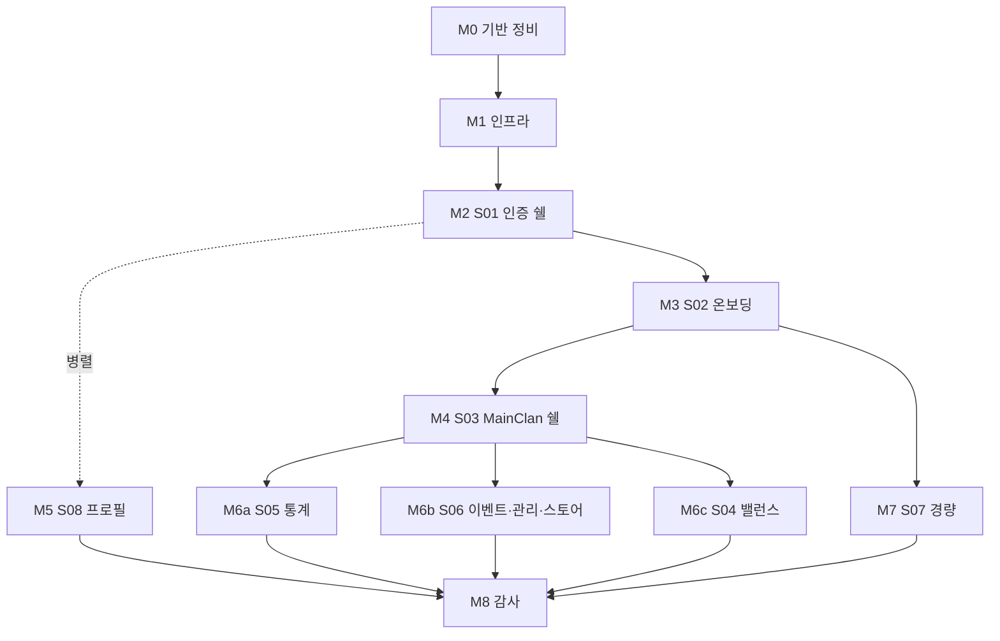

# Phase 2 — Next.js `src/` · Supabase · RLS

> **허브**: [TODO.md](./TODO.md) · **Phase 1(종료)**: [TODO_Phase1.md](./TODO_Phase1.md) · **세션 로그**: [TODO_LOG.md](./TODO_LOG.md)  
> **단일 출처**: [pages.md](./01-plan/pages.md) (라우트) · [schema.md](./01-plan/schema.md) (DB) · [FEATURE_INDEX.md](./01-plan/FEATURE_INDEX.md) (슬라이스)

| 항목 | 값 |
|------|-----|
| **단계** | Phase 2 — 앱 구현 |
| **마지막 갱신** | 2026-04-21 — 마스터 플랜(M0~M8) 착지, `[locale]` 세그먼트 제거 |

## 전제 (Q&A 확정)

- **Q1 (로케일)**: `src/app/[locale]/`는 제거. `pages.md` 라우팅 맵을 1:1로 따른다. 다국어 재도입은 Phase 2+에서 `next-intl` 등으로 별건 처리.
- **Q2 (범위)**: Phase 2 종료선 = **S00~S06, S08 전체 + S07 경량 탭 4개**(홈·클랜 홍보·LFG·클랜 순위). 스크림 채팅(**D-SCRIM-01/02**)·게시판 상세(`/games/[g]/board/[postId]`)·승부예측 정산·서비스워커 푸시·다국어는 **Phase 2+** 이관.

## 마일스톤 로드맵

| 마일스톤 | 슬라이스 | 핵심 산출물 | 선행 | 상태 |
|----------|----------|-------------|------|------|
| **M0** 기반 정비 | — | `[locale]` 제거 · 랜딩 스텁 · 본 로드맵 문서화 | — | 진행 중 |
| **M1** 인프라 | — | Supabase 헬퍼 · `supabase/migrations/0001_init` · `middleware.ts` 골격 · ENV · `db:*` scripts | M0 | 대기 |
| **M2** 인증 쉘 | **S01** | `/` · `/sign-in` · `/sign-up` · `/games` + D-AUTH-01 매트릭스 + D-AUTH-03/06/07 | M1 | 대기 |
| **M3** 온보딩 | **S02** | `/games/[g]/auth` (OAuth D-AUTH-02/05) · `/games/[g]/clan` (D-CLAN-01/02/04) + RLS 1차 | M2 | 대기 |
| **M4** MainClan 쉘 | **S03** | `/games/[g]/clan/[id]` 레이아웃·사이드바(D-SHELL-01/02/03)·`hasPermission()`(D-PERM-01)·플랜 토글 | M3 | 대기 |
| **M5** 프로필 | **S08** | `/profile` 네임플레이트·뱃지 케이스 (D-PROFILE-01~04) | M2 (병렬 가능) | 대기 |
| **M6a** 통계 | **S05** | MainClan `/stats` 탭 · HoF (D-STATS-03/04) | M4 | 대기 |
| **M6b** 이벤트·관리·스토어 | **S06** | `/events`(D-EVENTS-03) · `/manage`(D-CLAN-02 소비자·D-MANAGE-01~04) · `/store`(D-STORE-01/02·D-ECON-03) | M4 | 대기 |
| **M6c** 밸런스 | **S04** | `/balance` 세션·밴픽·M/A 점수·슬롯 (정산 서버정책은 Phase 2+ placeholder) | M4 | 대기 |
| **M7** 커뮤니티 경량 | **S07** | `/games/[g]` 홈·홍보(D-RANK-01)·LFG(D-LFG-01)·순위. 스크림 탭은 "Phase 2+ 예정" 안내만 | M3 | 대기 |
| **M8** 종료 감사 | — | `AUDIT-Phase2-YYYY-MM-DD.md` · Phase 2+ 이관 목록 · 허브 갱신 | M5·M6a~c·M7 | 대기 |

## 마일스톤 공통 완료 기준 (Gate)

매 마일스톤마다 아래 5개를 전부 만족해야 다음으로 넘어간다.

1. 해당 슬라이스의 **수용 기준 체크박스 전부 ✓**([FEATURE_INDEX.md](./01-plan/FEATURE_INDEX.md) 링크 참조).
2. [pages.md §페이지별 가드 체인 표](./01-plan/pages.md)의 대응 경로가 `middleware.ts`·Server Component 가드에서 **전부 통과**.
3. RLS 정책이 **leader / officer / member / guest** 4역할에서 최소 1 케이스씩 테스트 통과 (`supabase db test` 혹은 Playwright).
4. 본 문서의 **체크리스트·라우트 대응표 갱신**.
5. Nano-commit([.cursor/rules/git-nano-commit.mdc](../.cursor/rules/git-nano-commit.mdc)) 준수 + 세션 로그([TODO_LOG.md](./TODO_LOG.md)) 블록 추가.

## 체크리스트 (마일스톤별 상세)

### M0 — 기반 정비

- [x] `src/app/[locale]/` 제거 + 랜딩 스텁 (`src/app/page.tsx`)
- [x] `docs/TODO_Phase2.md`에 M0~M8 마스터 플랜 반영
- [ ] `docs/TODO.md` 권장 프롬프트·마지막 갱신, `docs/TODO_LOG.md` 세션 로그

### M1 — 인프라 베이스라인

- [ ] `@supabase/ssr` + `@supabase/supabase-js` 도입
- [ ] `src/lib/supabase/{server,client,middleware}.ts` 헬퍼
- [ ] `supabase/migrations/0001_init.sql` — `users`·`user_game_profiles`·`games`·`clans`·`clan_members` + 기본 RLS
- [ ] `middleware.ts` 골격 (세션 refresh + **D-SHELL-02** 쿼리 정화: `?role=`·`?plan=`·`?game=` 프로덕션 드롭)
- [ ] `.env.local` / `.env.example` 템플릿 + `next.config.ts` 서버 전용 ENV 분리
- [ ] `package.json` scripts: `db:reset` · `db:push` · `types:gen`

### M2 — S01 라우팅·쉘 (수직 슬라이스 첫 완주)

- [ ] `/` 랜딩 — **D-LANDING-04** 로그인 상태 CTA 분기
- [ ] `/sign-in` — 이메일/비번 + **D-AUTH-06** 잠금(10회/15분) + **D-AUTH-07** 자동 로그인(30일)
- [ ] `/sign-up` — **D-AUTH-03** 비밀번호 ≥12자·연령·약관
- [ ] `/games` — 게임 카드 + `data-game/auth/clan-status/clan-id/clan-name` + `routeFromGameCard` (D-AUTH-01 6칸)
- [ ] 게이트: 익명 방문 → 회원가입 → 로그인 → `/games` 클릭스루 성공

### M3 — S02 게임·클랜 온보딩

- [ ] `/games/[gameSlug]/auth` — **D-AUTH-02** OAuth 매핑 · **D-AUTH-05** Discord scope · `?reauth=1` 분기
- [ ] `/games/[gameSlug]/clan` — 가입 탭(**D-CLAN-01** 검색/페이지네이션 · **D-CLAN-02** 상태머신) + 생성 탭(**D-CLAN-04** payload)
- [ ] RLS 1차: `clans` 공개 SELECT, `clan_members` 본인+officer+ SELECT, `clan_join_requests` 본인+운영진
- [ ] 게이트: D-AUTH-01 6칸이 middleware에서 전부 통과

### M4 — S03 MainClan 쉘

- [ ] `/games/[g]/clan/[clanId]` 레이아웃 + 사이드바 (**D-SHELL-01/02/03**)
- [ ] 서버 헬퍼 `hasPermission(userId, clanId, key)` (**D-PERM-01** 권한 매트릭스)
- [ ] 플랜 게이트 — Free/Premium 서버 토글 (실결제는 Phase 2+)
- [ ] 탭 스텁 5개 라우트 (`/balance`·`/stats`·`/events`·`/manage`·`/store`)
- [ ] 게이트: 사이드바 알림 점 규칙 + 디버그 쿼리 차단

### M5 — S08 프로필·꾸미기 (M2 이후 병렬 가능)

- [ ] `/profile` — 네임플레이트·뱃지 케이스 (**D-PROFILE-01~04**, 5슬롯 dense-from-front)
- [ ] 스키마: `user_nameplate`·`user_badges`·`user_badge_picks`
- [ ] `clansync:badge:picks:changed` 브로드캐스트 → 서버 컴포넌트 패턴 재설계

### M6 — MainClan 탭 묶음 (M4 이후, 권장 순서 a→b→c)

- [ ] **M6a S05 클랜 통계** — HoF 모달 · **D-STATS-03/04**
- [ ] **M6b S06 이벤트·관리·스토어** — **D-EVENTS-03** 디스코드 알림 · **D-MANAGE-01~04** · **D-STORE-01/02** · **D-ECON-03**
- [ ] **M6c S04 밸런스메이커** — 세션·밴픽·M/A 점수. 승부예측 정산은 Phase 2+ placeholder UI만

### M7 — S07 MainGame 커뮤니티 (경량판)

- [ ] `/games/[g]` 홈·클랜 홍보(**D-RANK-01**)·LFG(**D-LFG-01** 상태머신)·클랜 순위
- [ ] 스크림 탭은 "Phase 2+ 예정" 안내 화면만
- [ ] `/games/[g]/board/[postId]`는 **라우트 미작성** (Phase 2+)

### M8 — Phase 2 종료 감사

- [ ] `docs/AUDIT-Phase2-YYYY-MM-DD.md` 생성 (Phase 1 감사 포맷 복제)
- [ ] Phase 2+ 이관 목록 확정 (스크림 채팅·2-phase·게시판 상세·승부예측 정산·서비스워커 푸시·다국어 등)
- [ ] [TODO.md](./TODO.md) 현재 단계 = "Phase 2 완료 · Phase 2+ 진입"

## 라우트 대응표 ([pages.md](./01-plan/pages.md) 기준)

| # | 제품 경로 | 목업 | 마일스톤 | 구현 상태 |
|---|-----------|-----|---------|----------|
| 01 | `/` | `index.html` | M0 스텁 → M2 | stub |
| 02 | `/sign-in` | `sign-in.html` | M2 | — |
| 03 | `/sign-up` | `sign-up.html` | M2 | — |
| 04 | `/games` | `games.html` | M2 | — |
| 05 | `/games/[gameSlug]/auth` | `game-auth.html` | M3 | — |
| 06 | `/games/[gameSlug]/clan` | `clan-auth.html` | M3 | — |
| 07 | `/games/[gameSlug]/clan/[clanId]` | `main-clan.html#dashboard` | M4 | — |
| 09 | `/games/[gameSlug]/clan/[clanId]/balance` | `main-clan.html#balance` | M6c | — |
| 10 | `/games/[gameSlug]/clan/[clanId]/stats` | `main-clan.html#stats` | M6a | — |
| 11 | `/games/[gameSlug]/clan/[clanId]/events` | `main-clan.html#events` | M6b | — |
| 12 | `/games/[gameSlug]/clan/[clanId]/manage` | `main-clan.html#manage` | M6b | — |
| 13 | `/games/[gameSlug]/clan/[clanId]/store` | `main-clan.html#store` | M6b | — |
| 08 | `/games/[gameSlug]` | `main-game.html` (홈·홍보·LFG·순위) | M7 | — |
| — | `/games/[gameSlug]` 스크림 탭 | `main-game.html#scrim` | **Phase 2+** | 보류 |
| — | `/games/[gameSlug]/board/[postId]` | _(목업 없음)_ | **Phase 2+** | 보류 |
| 14 | `/profile` | `profile.html` | M5 | — |

Phase 1 정적 목업(`mockup/`)은 참조용으로 유지; 운영 빌드에서는 제외 정책(**D-SHELL-02**)을 따른다.
