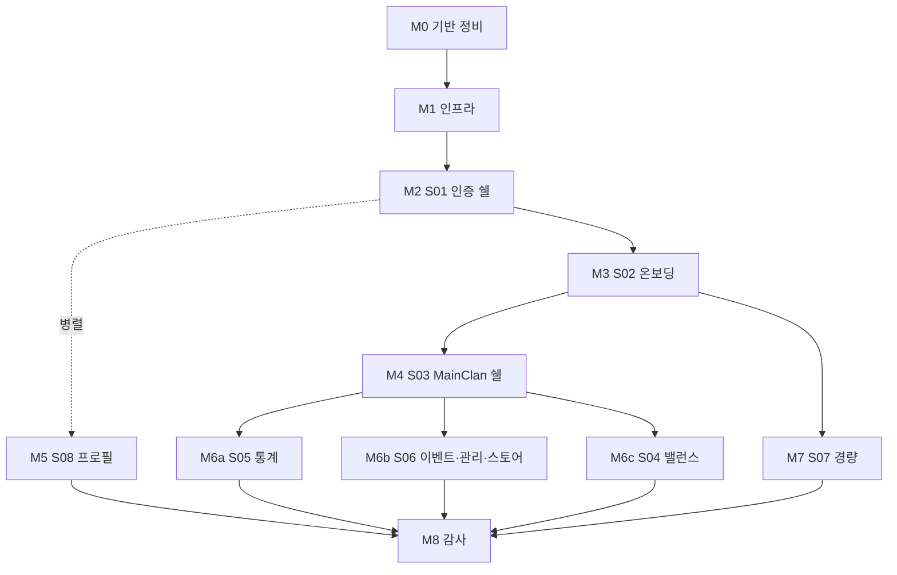

# Phase 2 — Next.js `src/` · Supabase · RLS

> **허브**: [TODO.md](./TODO.md) · **Phase 1(종료)**: [TODO_Phase1.md](./TODO_Phase1.md) · **세션 로그**: [TODO_LOG.md](./TODO_LOG.md)  
> **기획 기준**: [pages.md](./01-plan/pages.md) (라우트 요구) · [schema.md](./01-plan/schema.md) (DB 설계) · [FEATURE_INDEX.md](./01-plan/FEATURE_INDEX.md) (슬라이스)
> **실제 구현**: `src/` · `supabase/migrations/`와 대조한다. 아래 `live`는 구현 표기이며 원격 배포·품질 게이트 통과를 보증하지 않는다. 시연은 [QA_시나리오.md](./QA_시나리오.md) 참조.

| 항목 | 값 |
|------|-----|
| **단계** | Phase 2 — 기능 구현 후 품질 점검, M8 미완료 |
| **마지막 갱신** | 2026-09-16 — 개인 선호·명단 자동 저장·설정·공유 연출·기록 drawer QA 반영 |

## 2026-09-16 밸런스메이커 QA 피드백 반영

**추가 수정 — 역할 아이콘 입력:** 프로필·라운드의 텍스트 선호 목록을 아이콘 순서 입력으로 교체했다. 드래그·클릭 교환·좌우 방향키와 프로필 복귀/선호 없음/실패 복구를 확인했다. 빌드·타입·변경 파일 린트, 관련 Playwright 18건(17건 통과 후 저장 완료 대기를 보완한 내전 통합 1건 재검증) 통과. QA 운영진과 클랜원 클라이언트는 localhost/127.0.0.1의 별도 로그인으로 함께 테스트한다. DB/API 변경은 없다.

**적용 환경은 QA DB·로컬 앱이며 운영 반영은 보류한다.** `codex/live-session-formation`에서 작업한다. QA 마이그레이션은 기존 53개에 선호/설정·공개 감사/설정 보호·추첨 주장 보호 3개를 더한 **56개**다. 운영은 **50개**를 유지하며 main 반영 전 총 **6개**의 적용이 필요하다. 현재 사용자의 QA 클랜·열린 라운드·명단은 초기화하지 않는다.

- **명단:** 400ms 자동 저장과 쓰기 순서 직렬화. 편성·설정 적용 전 미완료 저장을 기다리며 서버 revision 충돌·연결 오류에서 로컬 변경을 보관한다. 다른 화면 변경은 재적용 또는 최신 명단 불러오기로 해결한다.
- **선호:** 게임별 프로필 선호는 본인이 저장한다. 출전자는 편성 시작 전에 이번 라운드만 덮어쓰거나 프로필 기본값으로 복귀할 수 있다. 미설정/선호 없음은 남은 역할 자리에서 추첨하며 체크인·운영진의 선호 재입력은 요구하지 않는다. 비공개 순위는 본인 외 화면과 공개 편성 상태에 전달하지 않는다. 프로필 저장의 중복 경로 갱신을 제거하고 저장 응답에서 입력 잠금을 해제한다. 실패 시 마지막 확정값으로 복구한다.
- **설정:** 역할 직접 배정/공통 순서 추첨, 현재 팀 유지/역할별 추첨/주장 지명/경매, 같은 역할 주장, 경매 예산·최소/증액 단위·시간, 맵/영웅 밴을 한 패널에서 저장한다. 다음 라운드에는 규칙·밴픽을 이어 쓰고 주장 지정·개인 라운드 선호·추첨 이력은 초기화한다. 다른 운영진이 바꾼 설정을 오래된 편집본으로 덮어쓰지 않도록 기준값도 확인한다. 적용 중 패널 닫기를 잠그고 부모 화면이 저장 이후 revision을 받은 뒤 닫아 직후 시작 요청의 이전 설정 사용을 방지한다. 그 사이 다른 운영진이 다시 변경했으면 최신 규칙 확인을 안내한다.
- **동시성·복구:** 편성 시작은 클릭 당시 명단·설정·밴픽과 추첨 이력 길이를 확인한 뒤 최신 개인 선호를 해석하고 최종 revision CAS로 저장한다. 개인 선호만 먼저 저장된 경우는 수용하되 시작→초기화 뒤 도착한 오래된 시작 요청은 거부한다. Realtime 인증을 동기화하고 DB 구독 준비/재연결 시 놓친 변경을 재조회한다. 화면이 보이는 동안 활성 라운드는 2초(없으면 5초)마다 작은 revision 상태만 비교하며 변경 시 페이지를 갱신한다. 투표·예측·M/A 등 별도 상태는 30초 전체 갱신으로 복구한다.
- **공개·배치:** 서버가 저장한 추첨 식별자·순서·결과를 약 4초 동안 기존 참가자 영역에서 공개한다. 직접 배정+현재 팀 유지에는 가짜 추첨 연출을 넣지 않는다. 완료 결과용 명단을 중복 배치하거나 다시 보기 버튼을 만들지 않는다. 공유 화면은 읽기 전용이며 같은 결과·진행 시점을 사용한다.
- **안내·기록:** 안내 아이콘을 눌렀을 때만 대상 영역을 강조하는 단계별 도움말을 연다. 기록 아이콘은 데스크톱 넓은 drawer/모바일 전체 화면으로 최근 30세션을 조회한다. 개설 KST 날짜·라운드 명단/맵/결과, 유효 승패만의 고유 출전·승률·현재 연속 승패, 공개 추첨 순서/시각/규칙/초기화 이력을 표시한다. 0경기 승률은 `—`이며 개인 선호·베팅 내역은 포함하지 않는다.
- **검증 완료 범위:** 역할/편성 순수 로직 14건, 자동 저장 8건, 기록 6건, QA DB 전체 **44건**(기존 37+선호 7), SQL 린트·빌드·타입·src 린트 통과. 기록 조회의 회원/비회원 RLS와 사용자 QA의 안내·기록·설정 읽기 화면을 확인했다.
- **브라우저 검증 범위:** 전체 회귀 82건 통과 후 수정한 내전 통합 1건과 프로필 1건 개별 재검증 통과, **총 84시나리오**. 내전 통합은 자동 저장·개인 선호·실시간 반영·설정 적용 직후 시작·공유 추첨·지명·경매·기록을, 프로필은 연속 저장과 실패 시 확정값 복구를 확인한다. 새 내전 테스트는 독립 사용자 12명·임시 클랜을 생성/정리하며 프로필 테스트도 별도 임시 사용자를 쓴다. 실행 시 `E2E_SKIP_SEED=1`로 기존 세션을 보존한다.

세부 화면·후속 범위는 [편성 명세](02-design/formation-modes.md), 실행 명령은 [E2E 안내](../e2e/README.md)를 따른다.

## 2026-09-16 실제 내전 운영 페이지

**이 절은 최초 적용 당시 기록이다.** 사용자 지시로 QA DB·로컬 앱에 적용했고 운영 DB·운영 배포는 보류했다. 당시 운영 50개·QA 53개 마이그레이션이었으며 현재 상태는 위 피드백 반영 기록을 따른다.

- 세션 부모 `balance_session_series`와 라운드 `balance_sessions`를 분리했다. 개설 한국 날짜 고정·회차·다음 라운드 명단 유지·라운드별 결과/예측/기록을 저장한다. 기존 데이터는 각각 한 라운드 세션으로 보존한다.
- 수동 명단의 DD/T/SS 배치, 순차 입력, 선택자 숨김, 우클릭·드래그·되돌리기·초기화 및 최근 참여순을 반영했다. 최근 확정 100개 라운드를 정렬 근거로 사용하며 이력 밖 인원은 닉네임순이다.
- 역할 직접 배정/공통 무작위 순서, 현재 팀 유지/역할별 추첨/같은 역할 주장 지명/1,000P 경매를 조합했다. 당시 운영진 선호 입력은 위 후속 구현에서 프로필 기본값·본인 라운드 선호로 대체했다.
- 클랜원은 실제 계정 권한으로 실시간 상태를 확인하고, 주장은 자기 팀의 지명/입찰을 한다. 운영진은 대리 조작 가능하다. 공유 화면은 읽기 전용이며 개인 선호·베팅정보·설정을 제외한다.
- 경매는 서버 마감·5초 연장(최대50초)·예산 예약·무입찰 재경매/최소가 추첨을 검증한다. 운영진이 마감을 실행하며 백그라운드 자동 마감은 후속이다.
- 진행 중 라운드는 결과를 확정해야 다음 라운드/세션 종료가 가능하다. 시작 전 편집 라운드는 취소 기록을 남겨 닫을 수 있다. 일반 사용자의 상태 직접 쓰기·단계 역행·동시 중복 저장을 차단한다.
- 검증: QA DB 회귀 37건 통과(기존24·세션6·편성7). 빌드·타입·전체 src 린트 통과. 브라우저/로직 회귀 66건 통과(전체65건 및 새 내전 시나리오의 중복 문구 선택자 수정 후 해당1건 재실행). 보안 advisor에는 기존 경고만 남고 신규 세션/편성 관련 경고는 없었다.

## 2026-09-16 UX-01 기획·코드 대조 (구현 전 기록)

- [x] **후속 구현 완료(위 기록 참고), 당시 확인:** 참가자 목록 기본은 최근 참여순이다. 목업 `mockup/pages/main-clan.html`의 `mock-balance-pool-sort` 첫 옵션에도 있으나, 현재 [명단 RPC](../supabase/migrations/0019_balance_session_roster.sql)는 닉네임순으로 반환하고 [편집기](../src/components/main-clan/clan-balance-roster-editor.tsx)는 검색 필터만 적용한다.
- **현재 동작:** 결과 입력 후 기존 세션의 로스터는 유지한다. 세션 종료 후 [새 세션 생성](../src/app/actions/clan-balance-session.ts)에서는 로스터를 복사하지 않아 빈 기본값으로 시작한다. 최근 참여순 정렬, 참가 인원 선택 유지, 팀·역할 배치 복사는 별개의 동작이다.
- **검증 범위:** 코드·마이그레이션 읽기 확인만 수행했다. 운영 DB·브라우저 재현과 수정은 하지 않았다. 기존 정렬 반영과 별개로 직전 판 선택 재사용의 채택·범위는 [D-UX-01](01-plan/product-design-evolution.md#ux-01)에서 논의 중이다.

## 2026-09-15 로그인·페이지 이동 성능 개선

- 운영 함수가 미국 `iad1`, Supabase가 서울 `ap-northeast-2`에서 실행되는 것을 확인했다. `vercel.json`의 함수 지역을 `icn1`으로 지정했다. [Vercel 함수 지역 설정](https://vercel.com/docs/functions/configuring-functions/region).
- 정상 로그인은 검증된 비밀번호 인증 응답을 재사용하고 프로필 저장·잠금 초기화를 병렬 처리한다. 프로필이 없을 때 복구하는 경로는 유지한다.
- RSC 렌더 안에서만 인증 사용자·클랜 맥락·권한 조회를 재사용한다. 사용자 간 공유 캐시는 없고 Server Action은 새 권한을 조회한다. 클랜 공통 조회와 관리·이벤트 본문은 독립 요청을 병렬 처리한다.
- 페이지 이동 표시·경로별 로딩 화면을 추가했다. 홍보 정렬은 현재 목록을 재정렬하며 검색과 브라우저 기록을 유지한다.
- 회귀 검사에서 발견한 인증 쿠키 400일 덮어쓰기를 수정했다. 로그인·서버/브라우저 갱신에 24시간/30일 선택을 유지한다. 공지 편집창의 지연된 초기 초점도 수정해 빠른 제목·본문 입력이 섞이지 않도록 했다.
- 검증: 운영 설정 빌드·타입 검사·전체 `src` 및 변경 테스트 ESLint 통과. 전체 회귀 43건 중 42건 통과 후 공지 편집 수정·해당 1건 재실행 통과. DB 스키마 변경 없음.

운영 코드 `1fcbc8e`의 Git 자동 배포가 production READY이며 페이지 함수의 `icn1` 실행을 확인했다. Middleware는 Vercel의 분산 Edge 실행을 유지한다. 새 배포 error 로그 조회 결과 0건.

동일 PC의 Chromium·1280×800·한국어 환경에서 운영의 기존 QA 리더로 각 3회 측정했다. 매회 새 브라우저 컨텍스트를 사용하고, 로그인 제출/클릭/직접 진입부터 해당 화면 확인까지 재었다. 비교 기준은 `8f4cd7e` → `1fcbc8e`, 아래는 **중앙값(ms)**이다. 지역 변경과 코드 개선이 함께 반영된 결과이며 각각의 효과를 분리한 실험은 아니다.

| 동작 | 개선 전 | 개선 후 | 감소 |
|------|--------:|--------:|-----:|
| 로그인 → 게임 선택 | 8,156 | 1,911 | 77% |
| 클랜 첫 진입 | 5,430 | 1,822 | 66% |
| 밸런스메이커 | 4,953 | 1,372 | 72% |
| 클랜 통계 | 3,426 | 1,876 | 45% |
| 이벤트 | 7,007 | 1,357 | 81% |
| 클랜 관리 | 10,601 | 1,369 | 87% |
| 클랜 스토어 | 5,972 | 1,360 | 77% |

편차도 남아 있다. 배포 직후 첫 로그인은 6,165ms였고 두 번째 측정의 통계·이벤트는 각각 4,968ms·5,482ms였다. 이후 별도 요청 추적에서는 해당 편차를 재현하지 못했다. 소표본 측정이므로 응답 시간 보장으로 해석하지 않으며, 간헐 지연 원인은 후속 계측 대상이다.

## 2026-09-15 초기 리뷰 수정 기록

[코드 리뷰 보고서](./03-analysis/code-review-2026-09-15.md)에 결함별 수정·검증·운영 적용 범위를 기록했다. M8 완료 감사는 별도다.

| 검증 | 결과 |
|------|------|
| 프로덕션 빌드 | 컴파일·타입 검사·라우트 생성 통과 |
| 전체 `npm run lint` | 오류·경고 0건 |
| 전체 Playwright | 한국 브라우저·UTC 서버 시간대 검증을 포함한 20건 통과 |
| DB RLS·RPC·동시성 | 테스트 DB의 8개 시나리오 통과 (Node 상위 suite 포함 9개) |
| 테스트 DB 마이그레이션 | 48개 적용 |
| 운영 DB·앱 배포 | 마이그레이션 48개·권한 검증·타입 동기화 완료, Vercel production READY·공개 응답·cron 인증 확인 |
| 반응형·키보드·접근성 전수 감사 | 미완료 |

- [x] R01~R05: 서비스 RPC·사용자 쓰기·게임 인증·RLS·LFG 권한 수정과 테스트 DB 허용/거부 검증.
- [x] R06~R09: 알림 재예약·시간대·클랜/LFG 동시 승인 회귀 검증.
- [x] 앱 린트 오류 해소와 정적 목업·생성 파일 제외.
- [x] 운영 DB 적용 및 앱 푸시·자동 배포 검증.
- [ ] PR 필수 CI와 UI 게이트 실행 후 M8 재평가.

## 전제 (Q&A 확정)

- **Q1 (로케일)**: `src/app/[locale]/`는 제거. `pages.md` 라우팅 맵을 1:1로 따른다. 다국어 재도입은 Phase 2+에서 `next-intl` 등으로 별건 처리.
- **Q2 (범위)**: Phase 2 구현 범위는 아래 마일스톤별 체크리스트 기준. 게시판 단일 글 상세·스크림 매칭 MVP·승부예측 기본 코인 처리는 구현되어 있다. 스크림 채팅·게시판 댓글/반응·파리뮤추엘 배당 고도화·서비스워커 푸시·다국어는 Phase 2+다. 실제 게임 OAuth와 구독 결제도 후속 범위다.

## 마일스톤 로드맵

| 마일스톤 | 슬라이스 | 핵심 산출물 | 선행 | 상태 |
|----------|----------|-------------|------|------|
| **M0** 기반 정비 | — | `[locale]` 제거 · 랜딩 스텁 · 본 로드맵 문서화 | — | 완료 |
| **M1** 인프라 | — | Supabase 헬퍼 · `supabase/migrations/0001_init` · `middleware.ts` 골격 · ENV · `db:*` scripts | M0 | 완료 (Vercel preview 제외) |
| **M2** 인증 쉘 | **S01** | `/` · `/sign-in` · `/sign-up` · `/games` + D-AUTH-01 매트릭스 + D-AUTH-03/06/07 | M1 | 완료 |
| **M3** 온보딩 | **S02** | `/games/[g]/auth` (OAuth D-AUTH-02/05) · `/games/[g]/clan` (D-CLAN-01/02/04) + RLS 1차 | M2 | 완료 |
| **M4** MainClan 쉘 | **S03** | `/games/[g]/clan/[id]` 레이아웃·사이드바(D-SHELL-01/02/03)·`hasPermission()`(D-PERM-01)·플랜 토글 | M3 | 완료 |
| **M5** 프로필 | **S08** | `/profile` 네임플레이트·뱃지 케이스 (D-PROFILE-01~04) | M2 (병렬 가능) | 완료(기능 구현) · 품질 검증 별도 |
| **M6a** 통계 | **S05** | MainClan `/stats` 탭 · HoF (D-STATS-03/04) | M4 | 완료 |
| **M6b** 이벤트·관리·스토어 | **S06** | `/events`(D-EVENTS-03) · `/manage`(D-CLAN-02 소비자·D-MANAGE-01~04) · `/store`(D-STORE-01/02·D-ECON-03) | M4 | **완료(Phase 2 약정)** — 카카오 `event_notify` 옵트인·대진 초안에 팀 슬롯 라벨; 잔여 코인 호스트결제·실 카카오 파이프·스크림 채팅·대진 진행 UI는 Phase 2+ |
| **M6c** 밸런스 | **S04** | `/balance` 세션·맵밴 MVP·영웅 밴(OW)·M/A·예측 5분·결과 확정·클랜코인 적중 지급 | M4 | **완료(Phase 2 약정)** — Realtime 동기화·Playwright 스모크; **Phase 2+**: 파리뮤추엘식 배당 고도화·타 게임 히어로 풀·내전 통계 연동 등 |
| **M7** 커뮤니티 경량 | **S07** | `/games/[g]` 홈·홍보(D-RANK-01)·LFG(D-LFG-01)·순위·**스크림 탭**(MVP) · 게시판 **단일 글** `/board/[postId]`(읽기 MVP) | M3 | 완료 |
| **M8** 종료 감사 | — | `AUDIT-Phase2-YYYY-MM-DD.md` · Phase 2+ 이관 목록 · 허브 갱신 | M5·M6a~c·M7 | 대기 |

```mermaid
flowchart TD
  M0[M0 기반 정비] --> M1[M1 인프라]
  M1 --> M2[M2 S01 인증 쉘]
  M2 --> M3[M3 S02 온보딩]
  M3 --> M4[M4 S03 MainClan 쉘]
  M2 -.병렬.-> M5[M5 S08 프로필]
  M4 --> M6a[M6a S05 통계]
  M4 --> M6b[M6b S06 이벤트·관리·스토어]
  M4 --> M6c[M6c S04 밸런스]
  M3 --> M7[M7 S07 경량]
  M5 --> M8[M8 감사]
  M6a --> M8
  M6b --> M8
  M6c --> M8
  M7 --> M8
```

## 마일스톤 공통 완료 기준 (Gate)

매 마일스톤마다 아래 **기술 게이트 5 + UI/UX 게이트 3**을 전부 만족해야 다음으로 넘어간다.

### 기술 게이트 (5)

1. 해당 슬라이스의 **수용 기준 체크박스 전부 ✓**([FEATURE_INDEX.md](./01-plan/FEATURE_INDEX.md) 링크 참조).
2. [pages.md §페이지별 가드 체인 표](./01-plan/pages.md)의 대응 경로가 `middleware.ts`·Server Component 가드에서 **전부 통과**.
3. RLS 정책이 **leader / officer / member / guest** 4역할에서 최소 1 케이스씩 테스트 통과 (`supabase test db` 또는 직접 DB 접근의 허용·거부를 검증하는 테스트).
4. 본 문서의 **체크리스트·라우트 대응표 갱신**.
5. Nano-commit([.cursor/rules/git-nano-commit.mdc](../.cursor/rules/git-nano-commit.mdc)) 준수 + 세션 로그([TODO_LOG.md](./TODO_LOG.md)) 블록 추가.

### UI/UX 게이트 (3)

마일스톤에 UI 변경이 전혀 없는 경우(예: M1 인프라만)만 면제. 그 외 전부 필수.

6. **키보드 온리** — 마우스 없이 해당 마일스톤의 핵심 플로우 완주 가능(탭·엔터·스페이스).
7. **반응형 3폭** — 375 / 768 / 1280 px에서 레이아웃 깨짐·가로 스크롤 없음.
8. **로딩·에러·빈 상태** — 각 신규 화면에 세 상태 디자인이 전부 존재(빈 리스트 안내·실패 메시지·스켈레톤 또는 스피너).

> 시연·직접 재현 절차는 [QA_시나리오.md](./QA_시나리오.md)에만 유지한다.

## 체크리스트 (마일스톤별 상세)

### M0 — 기반 정비

- [x] `src/app/[locale]/` 제거 + 랜딩 스텁 (`src/app/page.tsx`)
- [x] `docs/TODO_Phase2.md`에 M0~M8 마스터 플랜 반영
- [x] `docs/TODO.md` 권장 프롬프트·마지막 갱신, `docs/TODO_LOG.md` 세션 로그 (M2 착지 시 갱신)

### M1 — 인프라 베이스라인

- [x] `@supabase/ssr` + `@supabase/supabase-js` 도입
- [x] `src/lib/supabase/{server,client,middleware}.ts` 헬퍼
- [x] `supabase/migrations/0001_init.sql` — `users`·`user_game_profiles`·`games`·`clans`·`clan_members` + 기본 RLS
- [x] `middleware.ts` 골격 (세션 refresh + **D-SHELL-02** 쿼리 정화: `?role=`·`?plan=`·`?game=` 프로덕션 드롭)
- [x] `.env.local` / `.env.example` 템플릿 (`next.config.ts` 서버 전용 ENV 분리는 M2 이후 서버 액션 도입 시 `env` 블록 or `serverRuntimeConfig` 로 확장)
- [x] `package.json` scripts: `db:reset` · `db:push` · `types:gen`
- [x] **Vercel preview URL 자동 발급** — `vercel link` + GitHub 연동 + Preview/Production 환경 변수 분리.

### M2 — S01 라우팅·쉘 (수직 슬라이스 첫 완주)

- [x] **픽스처·디버그** — [debug-and-fixtures.md](./01-plan/debug-and-fixtures.md) · **D-DEV-01**: `scripts/seed-fixtures.mjs` + `scripts/fixtures/qa-fixtures.mjs` + `npm run db:seed` — `QA_Member_01`·`QA_Leader_01`·`QA_Admin_01` + `QA_01_Clan`(리더 연결). 게임 카탈로그는 `0002` 시드.
- [x] `/` 랜딩 — **D-LANDING-04** 로그인 시 미들웨어에서 `/games` 리다이렉트(`?from=logo` 예외)
- [x] `/sign-in` — 이메일/비번 + **D-AUTH-06** 잠금(5회 연속/15분, [decisions.md §D-AUTH-06](./01-plan/decisions.md)) + **D-AUTH-07** 자동 로그인 토글(세션 쿠키 maxAge 24h/30d + `users.auto_login` 반영)
- [x] `/sign-up` — **D-AUTH-03** strong 비밀번호(8~72자)·출생연도(만 10세+)·약관
- [x] `/games` — Supabase 조회 기반 카드 + `routeFromGameCard` TypeScript · D-AUTH-01 라우팅(스텁: `/games/[g]/auth`·`/clan`·`/clan/[id]`)
- [x] 게이트: 익명 → `/sign-in?next=` · 로그인 후 `/games` · 카드 클릭 스텁까지 완주

### M3 — S02 게임·클랜 온보딩

- [x] `/games/[gameSlug]/auth` — **D-AUTH-02** 화면·CTA·비활성 게임 처리 · **D-AUTH-05** 안내 카피 · `?reauth=1` 분기 · 실 OAuth 전 **`DEV_GAME_LINK_SIMULATOR` / `NODE_ENV=development`** 시뮬레이터
- [x] `/games/[gameSlug]/clan` — 가입 탭(**D-CLAN-01** 검색·페이지 5 · **D-CLAN-02** 신청·취소·타 클랜 재신청 모달) + 생성 탭(**D-CLAN-04** payload + 서비스 롤 리더 멤버십)
- [x] RLS 1차: `0003` `clan_join_requests` 본인·운영진 SELECT, 본인 INSERT, 본인 pending→canceled UPDATE + `clans.game_id` 정합 `WITH CHECK`
- [x] 게이트: D-AUTH-01 미들웨어(`loadGameOnboarding`) — `/games/[g]`·`/auth`·`/clan`·`/clan/[id]` 분기

### M4 — S03 MainClan 쉘

- [x] `/games/[g]/clan/[clanId]` 레이아웃 + 사이드바 (**D-SHELL-01** 레일 hover·모바일 Sheet / **D-SHELL-03** manage 점 = pending 가입 신청)
- [x] 서버 헬퍼 `hasClanPermission` (**D-PERM-01** default + jsonb + 잠긴 키)
- [x] 플랜 게이트 — `clans.subscription_tier` + 클랜장 전용 dev 토글(`DEV_CLAN_PLAN_TOGGLE` / development)
- [x] 탭 스텁 5개 라우트 (`/balance`·`/stats`·`/events`·`/manage`·`/store`) · `/manage` 멤버 `forbidden()`
- [x] **D-SHELL-02** — 기존 미들웨어 정화 유지

### M5 — S08 프로필·꾸미기 (M2 이후 병렬 가능)

- [x] `/profile` — 네임플레이트·뱃지 스트립 (**D-PROFILE-01~03**, 5슬롯 dense-from-front) · 가입 신청 목록 (**D-PROFILE-02**)
- [x] 스키마: `nameplate_options` · `user_nameplate_inventory` · `user_nameplate_selections` · `badges` · `user_badge_unlocks` · `user_badge_picks` (`0010_profile_decorations_m5.sql`)
- [x] **부계동 D-MANAGE-03** · `user_alt_accounts` · `effective_view_alt_account_roles` (**`0043_user_alt_accounts.sql`**) · 인증된 게임 탭 내 UI·동의·서버 액션 (`14-Profile-Customization.md`)
- [x] `clansync:badge:picks:changed` · `clansync:nameplate:changed` 탭 동기화 — 리스너에서 `router.refresh()` · 활성 탭 `sessionStorage` 유지 (`profile-decoration-sync.ts`)

### M6 — MainClan 탭 묶음 (M4 이후, 권장 순서 a→b→c)

- [x] **M6a S05 클랜 통계** — 요약 KPI · HoF(설정 모달·등재 규칙·전체/월/연) · **D-STATS-03** 활동일 표·내전 막대 · **D-STATS-04** CSV 안내만 · 경기 기록 일자 목록(캘린더·정정은 M6b 후속)
- [x] **M6b S06 이벤트·관리·스토어** — **Phase 2 약정 범위 종료**(DB·`/events` MVP·`/manage`·`/store`·알림·스크림→일정 **`0041`** 등 기존 항목). **타 채널**: 카카오는 `clan_settings.event_notify.kakao_notifications_opt_in`(수신 의사) 저장·카피 명시까지. **대진표**: 초안 `snapshot` 팀 슬롯 라벨 생성·편집. **후속 Phase 2+**(본 체크 밖): 카카오 실 발송 번호 검증 파이프, 대진 진행·코인 입장연동, 스크림 채팅 등.
- [x] **M6c S04 밸런스메이커** — **Phase 2 약정 종료**( `0016`~`0026` 흐름: 세션·맵 후보 가중 무작위·영웅 밴 tally·예측 5분·`set_balance_match_outcome` 코인 처리·종료)·Realtime·운영 플로 UI. 픽스처 시드가 **`balance_sessions`(미종료) 삭제**. E2E: 편집→맵 건너뛰기→세션 종료 smoke. **Phase 2+**: 파리뮤추엘·Valorant 등 영웅 풀 확장·HoF/통계 깊은 연동.

### M7 — S07 MainGame 커뮤니티 (경량판)

- [x] `/games/[g]` — 홍보 `board_posts`(**D-RANK-01** newest/space) · LFG `lfg_posts`/`lfg_applications`(**D-LFG-01** MVP) · 클랜 순위 미리보기(`clan_active_member_counts` RPC)
- [x] 스크림 탭 — 월별 미니 캘린더·날짜 필터·날짜 헤더 목록(MainGame)·**상태·티어(SR 구간)·취소 숨김 필터 바**(`scrim-filter-bar`)
- [x] `/games/[g]/board/[postId]` — **단일 글 조회**(제목·본문·클랜 링크·복귀 `?tab=promo`) · `loadBoardPostDetail` · Phase 2+ 후보: 댓글·드로어 수준 고도화
- [x] LFG 만료 cron·알림(D-EVENTS-03 in-app) — `0039`·**`0042`**(`notification_log.lfg_post_id`·예약)·`expire_open_lfg_posts_batch`(plpgsql)·`/api/cron/dispatch-notifications`(만료 우선)·벨 **`clan_id` null 포함**·`?tab=lfg`

### M8 — Phase 2 종료 감사

- [ ] `docs/AUDIT-Phase2-YYYY-MM-DD.md` 생성 (Phase 1 감사 포맷 복제)
- [ ] Phase 2+ 이관 목록 확정 (스크림 채팅·2-phase·게시판 댓글·반응·승부예측 배당 고도화·서비스워커 푸시·다국어 등)
- [ ] [TODO.md](./TODO.md) 현재 단계 = "Phase 2 완료 · Phase 2+ 진입"

## 라우트 대응표 ([pages.md](./01-plan/pages.md) 기준)

| # | 제품 경로 | 목업 | 마일스톤 | 구현 상태 |
|---|-----------|-----|---------|----------|
| 01 | `/` | `index.html` | M0 스텁 → M2 | live (D-LANDING-04) |
| 02 | `/sign-in` | `sign-in.html` | M2 | live |
| 03 | `/sign-up` | `sign-up.html` | M2 | live |
| 04 | `/games` | `games.html` | M2 | live |
| 05 | `/games/[gameSlug]/auth` | `game-auth.html` | M3 | live |
| 06 | `/games/[gameSlug]/clan` | `clan-auth.html` | M3 | live |
| 07 | `/games/[gameSlug]/clan/[clanId]` | `main-clan.html#dashboard` | M4 | live (쉘+대시보드 스텁) |
| 09 | `/games/[gameSlug]/clan/[clanId]/balance` | `main-clan.html#balance` | M4→M6c | live (세션 편집→맵/영웅 밴 MVP·Realtime·예측 5분·M/A Premium A·코인 적중)·Phase 2+ 고도화 |
| 10 | `/games/[gameSlug]/clan/[clanId]/stats` | `main-clan.html#stats` | M4→M6a | live (M6a 본문) |
| 11 | `/games/[gameSlug]/clan/[clanId]/events` | `main-clan.html#events` | M4→M6b | live (캘린더·클랜 투표·대진 초안 팀 라벨·반복·스크림 RSVP · Discord 웹훅 MVP · 카카오 옵트인 플래그) |
| 12 | `/games/[gameSlug]/clan/[clanId]/manage` | `main-clan.html#manage` | M4→M6b | live (멤버 강퇴·역할·가입·플랜 패널) |
| 13 | `/games/[gameSlug]/clan/[clanId]/store` | `main-clan.html#store` | M4→M6b | live (MVP 구매·원장·거래 내역) |
| 08 | `/games/[gameSlug]` | `main-game.html` (홈·홍보·LFG·순위·스크림 MVP) | M7 | live |
| — | `/games/[gameSlug]` 스크림 탭 | `main-game.html#scrim` | M7 | live (MVP: 취소·호스트 일정 수정·게임 전체 클랜 상대 선택) |
| — | `/games/[gameSlug]/board/[postId]` | _(목업 없음)_ | M7 | live (단일 글 렌더; 댓글 등은 Phase 2+) |
| 14 | `/profile` | `profile.html` | M5 | live (M5 본문) |
| — | `middleware.ts` (전역) | _(해당 없음)_ | M1→M4 | 세션 refresh + D-SHELL-02 + **비로그인 `/games` 차단** · D-LANDING-04 · **D-AUTH-01** 게임 하위 경로 |

Phase 1 정적 목업(`mockup/`)은 참조용으로 유지; 운영 빌드에서는 제외 정책(**D-SHELL-02**)을 따른다.

## 구현 파일 찾기

- 앱·도메인 구조: [프로젝트 README](../README.md).
- DB 변경 이력: [`supabase/migrations/`](../supabase/migrations/). 설계 설명은 [schema.md](./01-plan/schema.md).
- 기능 요구·관련 파일: [FEATURE_INDEX.md](./01-plan/FEATURE_INDEX.md)에서 해당 슬라이스 하나를 선택.
- 과거 산출물 설명: [TODO_LOG.md](./TODO_LOG.md)와 Git 이력.

마이그레이션별 산출물 표를 별도로 복제하지 않는다.
